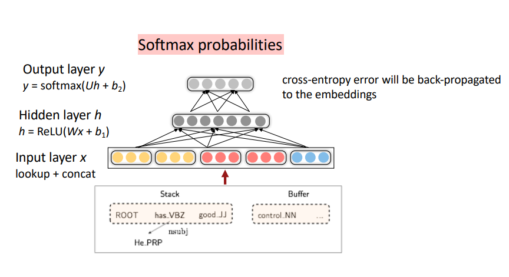

# Lecture 1 : Introduction and Word Vectors ~ Lecture 2 : Word Vectors 2 and Word Window Classification

## I. Contents

- Human language and word meaning
  - How do we represent the meaning of a word?
  - Word2Vec
  - GloVe
- Summary

## II. Human language and word meaning

### 1. How do we represent the meaning of a word?

#### (1) Definition : **meaning**
Webster 영영사전 : the idea that is represented by a word, phrase, etc.

표준국어대사전("의미") : 말이나 글의 뜻

#### (2) Commonest linguistic way of thinking of meaning :
\\[signifier(symbol) ↔ signified(idea or thing)\\]

#### (3) Common NLP solution
*WordNet*, a thesaurus containing lists of synonym sets and hypernyms

동의어, 유의어(synonyms) 또는 상의어(hypernyms)로 이루어진 사전을 통해 의미를 정의할 수 있다.

※ WordNet의 문제점
- 뉘앙스를 담을 수 없다.
- 단어의 새로운 의미를 담을 수 없다.
- 동의어 등을 판단하는 기준이 주관적이다.
- 제작하는데 인력이 많이 소모된다.
- **Word Similarity를 계산할 수 없다.**

#### (4) Representing words as discrete symbols
"One-hot vector" representing :
\\[motel = [0, 0, 0, 0, 0, 1, 0] \\ hotel = [0, 0, 0, 1, 0, 0, 0]\\]

※ One-hot vector representing의 문제점
모든 vector들이 orthogonal하기 때문에, similarity를 계산할 수 없다.

#### (5) Representing words by their context
**Distributional semantics** : A word's meaning is given by the words that frequency appear close-by.
When a word \\(w\\) appears in a textm its context is the set of words that appears nearby.

특정 단어의 의미는, 글에서 그 특정 단어 주변에 어떤 단어들(=context)이 주로 오는지에 따라 파악할 수 있다.
위 아이디어를 이용하여, 단어를 Vectorize 할 수 있다.

Note : Word vectors are also called word embeddings or word representations, They are a **distributed representation**.

#### (6) Conclusion
NLP에서 단어를 표현하는 방식으로 WordNet, discrete representations, distributed representation 등이 있다.
이때 NLP에서 "유용한" 방식으로 단어를 표현하기 위해서는, 단어 간 유사도(Similarity)를 계산할 수 있도록 distributed representation이 가장 적절한 해법이다.
Distributional semantics에서 착안하여, 단어들을 실수 벡터로 표현하는 방법으로 Word2Vec을 알아본다.

### 2. Word2Vec

#### (1) What is Word2Vec?

**Word2Vec** (Mikolov et al. 2013, [PDF](http://arxiv.org/pdf/1301.3781.pdf)) is a framework for learning word vectors.

{:width="60%" .center-image}

\\[Likelihood = L(\theta) = \prod_{t=1}^{T} \prod_{-m \le j\le m, j\ne0} P(w_{t+j}|w_t;\theta)\\]
\\[objective function = J(\theta) = -\frac{1}{T}log(L(\theta))\\]

특정 단어에 대하여, 주변(Window)에 다른 단어들이 나타날 확률의 곱 (첫번째 \\(\prod\\))을
모든 단어마다 계산해 곱해주면 (두번째 \\(\prod\\)), 이를 Likelihood라고 하며,
-Log를 취하여 objective function을 최소화 함으로써 word representation을 찾을 수 있다.

##### Likelihood란?

관측 데이터 \\(x\\)가 있을 때, 어떤 분포 \\(\theta\\)를 주고, 그 분포에서 데이터가 나왔울 확률을 말한다.
\\[L(\theta|x)=P_{\theta}(X=x)=\prod_{k=1}^n P(x_k|\theta)\\]
Word2Vec에서 \\(\theta\\)란 "to be defined in terms of our vectors", 즉 optimze할 word vector들의 값을 의미하며(이에 따라 분포가 정해진다),
위 Likelihood의 정의로부터 본다면, \\(w_t\\)마다 likelihood를 구한 후 T번 곱하는 것이라고 볼 수 있겠다.

#### (2) How to calculate the probability?
\\[P(o|c) = \frac{exp(u_o^Tv_c)}{\sum_{w\in V}exp(u_w^Tv_c)}\\]
This is an example of the **softmax function**.
The softmax fuction maps arbitrary values \\(x_i\\) to a probability distribution \\(p_i\\)
("max" because amplifies probability to smaller \\(x_i\\), "soft" because still assigns some probability to smaller \\(x_i\\))

#### (3) Optimization

Gradient descent, chain rule, SGD ... (생략)

#### (4) Word2Vec : More details

1. Two model variants
  - Skip-grams (SG) ☞ 위에서 한 내용
  - Continuous Bag of Words (CBOW)
2. Additional efficiency in Training
  - Naive softmax
  - Negative samlping

#### (5) The skip-gram model with negative sampling [PDF](http://papers.nips.cc/paper/5021-distributed-representations-of-words-and-phrases-and-their-compositionality.pdf)
Main idea : train binary logistic regressions for a true pair(center word and a word in its context window) versus several noise pairs (the center word paired with a random word)

Likelihood를 계산하는 식 중, softmax는 computationally expensive하므로(vocabulary에 있는 모든 단어에 대해 내적 필요), 이를 Negative-sampling을 이용한 방식으로 대체한다.

### 3. GloVe

#### (1) Co-occurrence matrix K

{:width="60%" .center-image}

- Window length 1 (most common : 5-10)
- ["I like deep learning", "I like NLP", "I enjoy flying"]

Co-occurrence matrix는 V * V 크기의 행렬이고, sparsity issue가 있으므로 차원을 낮추는 과정이 필요하며, 대표적으로 SVD(Singular Value Decomposition)이 있다.

이때, raw counts에 SVD를 바로 적용하는 것은 잘 작동하지 않고, the, he, has와 같이 과도하게 자주 등장하는 단어들(function words)의 count를 clipping하거나, count에 log를 취하거나, function words를 무시하는 방법 등을 추가로 요한다.

#### (2) GloVe
[GloVe: Global Vectors for Word Representation](http://nlp.stanford.edu/pubs/glove.pdf)

Q: How to we capture ratios of co-occurrence probabilities as linear meaning components in a word vector space?

A: Log-bilinear model (아래는 with vector differences)
\\[w_i\cdot w_j=logP(i|j) \\ w_x\cdot (w_a-w_b) = log {\frac{P(x|a)}{P(x|b)}}\\]

\\(w_i\cdot w_j=logP(i|j)\\) 가 되도록 \\(w\\)를 optimize하는 것이 목표이다. \\(P\\)는 co-occurrence matrix로 부터 계산됨.

\\[J = \sum^V_{i,j=1}f(X_{ij})(w_i^T\tilde w_j+b_i+\tilde b_j - logX_{ij})^2\\]

\\(f\\) -> clipping function fot function words

- Fast training
- Scalable to huge corpora
- Good performance even with small corpus and small vectors

#### (3) Evaluation of word vectors
Related to general evaluation in NLP : Intrinsic vs. extrinsic

##### Intrinsic word vector evaluation
1. Word vector analogies (ex. man : woman = king : ???, ??? = queen)
2. Word vector distances and their correlation with human judgements

##### Extrinsic word vector evaluation
1. Named entity recognition

#### (4) Word senses and word sense ambiguity
Most words have lots of meanings!

{:width="60%" .center-image}

1. [Improving Distributional Similarity with Lessons Learned from Word Embeddings](http://www.aclweb.org/anthology/Q15-1016) Huang et al. 2012
2. [Linear Algebraic Structure of Word Senses, with Applications to Polysemy](https://transacl.org/ojs/index.php/tacl/article/viewFile/1346/320) Arora et al. 2018

# III. Summary
Human language를 컴퓨터가 이해할 수 있도록 표현하기 위해서는 "word vector"를 설계해야한다. 이를 위한 시도들로 Word2Vec, GloVe를 알아보았다. Word2Vec은 SG 또는 CBOW로 구현할 수 있고, gradient descent를 효율적으로 하기 위해 negative sampling을 도입할 수 있다. GloVe는 co-occurrence matrix를 이용하여 word vector를 구한다.

Word vector를 만들었으면 이를 평가할 수 있어야 한다. NLP에서 평가 지표로 Intrinsic evaluation 또는 Extrinsic evaluation이 있다.

---

# Lecture 3 : Backprop and Neural Networks ~ Lecture 4 : Dependency Parsing

## I. Contents
- BackProp and Neural Networks
  - Simple NER
  - Backpropagation
- Dependency Parsing
  - Syntactic Structure : Constituency and Dependency
  - Dependecy Grammar and Treebanks
  - Transition-based dependency parsing
- Summary

## II. BackProp and Neural Networks

1. Simple NER : Window classification using binary logistic classifier

2. Backpropagation

CS231n에서 배웠던 내용과 대부분 중복되므로, 이해하는데 유용한 슬라이드 몇 장만 아카이브.

{:width="60%" .center-image}
{:width="60%" .center-image}
{:width="60%" .center-image}
{:width="60%" .center-image}
{:width="60%" .center-image}
{:width="60%" .center-image}
{:width="60%" .center-image}
{:width="60%" .center-image}

## III. Dependency Parsing
### 1. Syntactic Structure : Constituency and Dependency

#### (1) Constituency
Phrase structure organizes words into nested constituents.

- Starting unit : words
  - the, cat, cuddly, by, door
- Words combine into phrases
  - the cuddly cat, by the door
- Phrases can combine into bigger phrases
  - the cuddly cat by the door

#### (2) Dependency
Dependency structure shows which words depend on (modify, attach to, or are arguments of) which other words.

#### (3) Sentence structure

**Why do we need sentence structure?**

Humans communicate complex ideas by composing words together into bigger units to convey complex meanings. Listeners need to work out what modifies what. A model needs to understand sentence structure in order to be able to interpret language correctly.

**Ambiguities**

- Prepositional phrase attachment ambiguity
- Coordination scope ambiguity
- Adjectival/Advebial modifier ambiguity
- Verb phrase attachment ambiguity

### 2. Dependecy Grammar and Treebanks

#### (1) Dependecy Grammar

Dependency syntax postulates that syntactic structure consists of relations between lexical itemns, normally binary asymmetric relations ("arrows") called **dependencies**

{:width="60%" .center-image}

{:width="60%" .center-image}

We usually add a fake ROOT so every word is a dependent of precisely 1 other node.

#### (2) Treebanks

The rise of annotated data & Universal dependencies treebanks

{:width="60%" .center-image}

A treebank gives us many things
- Reusability of the labor
- Broad coverage, not just a few intuitions
- Frequencies and distributional information
- A way to evaluate NLP systems

Sources of information for dependency parsing
- Bilexical affinities
- Dependecy distances
- Intervening material
- Valency of heads

### 3. Transition-based dependency parsing
#### Basic transition-based dependency parser
- Arc-standard transition-based parser
  - 3 actions : SHIFT, LECT-ARC, RIGHT-ARC
- MaltParser
  - Each action is predicted by a discriminative classfier over each legal move.
  - It provides very fast linear time parsing, with high accuracy - great for parsing the web.

### 4. Neural dependency parsing
{:width="60%" .center-image}

Neural networds can accurately determine the structure of sentences, supporting interpretation.

## IV. Summary

문장을 이해하기 위해서는 각 단어가 어떤 단어를 수식하고 있는지 그 관계를 파악해야한다. 이를 Dependency라고 하며, 주어진 문장에 대해 그 수식 관계를 파악하는 것을 Dependency parsing이라고 한다. 수많은 corpus에 대해 Dependency parsing을 하는 것은 NLP에서 중요한 과제 중 하나이다.

Transition-based dependency parsing은 Stack, Buffer 개념을 도입하여 알고리즘으로 Dependency parsing을 하는 기법이다. MaltParser은 머신러닝을 이용해 높은 성능을 보여주었으며, 비교적 최근 인공신경망을 이용한 Neural dependency parsing은 가장 강력한 기법 중 하나로 자리잡았다. 그 외에도 Graph-based dependency parser 등이 있다.

---

# Lecture 5 : Recurrent Neural Networks and Language Models ~ Lecture 6 : Vanishing Gradients, Fancy RNNs, Seq2Seq

## I. Contents

- Neural Dependency Parsing
  - Neural Dependency Parsing
  - A bit more about neural Networks
- Language Modeling and RNNs
  - Language Modeling
  - N-grams Language Models
  - Neural Language Models
  - Evaluating Language Models
- LSTM : Long Short-Term Memory RNNs
  - Problems with Vanishing and Exploding Gradients
  - LSTMs
  - More about vanishing/exploding gradient Problem
  - Bidirectional and Multi-layer RNNs: Motivation
- Summary

## II. Neural Dependency Parsing

### 1. Neural Dependency Parsing
Deep learning classifiers are non-linear classifiers (cf. Traditional ML classifiers only give linear decision boundaries)

[A Fast and Accurate Dependency Parser using Neural Networks](https://www.emnlp2014.org/papers/pdf/EMNLP2014082.pdf) Chen and Manning, 2014

### 2. A bit more about neural networks
- Regularization
- Dropout
- Vectorization
- Non-linearities
- Parameter initialization
- Optimizers
- Learning rates

## III. Language modeling and RNNs

### 1. Language Modeling
**Language Modeling** is the task of predicting what word comes next.

More formally: given a sequence of words \\(x^{(1)},x^{(2)},\cdots,x^{(t)}\\), compute the probability distribution of the next word \\(x^{(t+1)}\\)

\\[P(x^{(t+1)}\mid x^{(t)},\cdots x^{(1)})\\]

where \\(x^{(t+1)}\\) can be any word in the vocabulary \\(V = {w_1, \cdots , w_{\mid V\mid }}\\)

주어진 단어들의 sequence가 있을 때, 그 다음에 올 단어의 확률분포를 구하는 것을 Language modeling이라고 한다.

각 sequence step마다 "단어가 다음에 올 확률"을 곱하면 전체 텍스트의 확률 분포가 되며, 식은 아래와 같다.

\\[P(x^{(1)},\cdots ,x^{(T)})=P(x^{(1)})\times P(x^{(2)\mid x^(1)}) \times \cdots \\ = \prod_{t=1}^T P(x^{(t)}\mid x^{(t-1)},\cdots ,x^{(1)}) \\]

### 2. N-gram Language Models
Idea : Collect statistics about how frequent different n-grams are and use these to predict next word.

First we make a **Markov assumption** : \\(x^{(t+1)}\\) depends only on the preceding \\(n-1\\) words

\\[P(x^{(t+1)}\mid x^{(t)},\cdots x^{(1)}) = P(x^{(t+1)}\mid x^{(t)},\cdots x^{(t-n+2)})
\\ = \frac {P(x^{(t+1)},x^{(t)},\cdots x^{(t-n+2)})} {P(x^{(t)},\cdots x^{(t-n+2)})} \\]

\\[\approx \frac {count(x^{(t+1)},x^{(t)},\cdots x^{(t-n+2)})} {count(x^{(t)},\cdots x^{(t-n+2)})}\\]

#### Problems of N-gram
- Sparsity Problems
  - Problem 1 : 위 식에서 분자 부분의 count가 0이라면, 해당 단어의 확률이 0으로 고정됨  
    Solution : Add small \\(\delta\\) to the count for every \\(w \in V\\)
  - Problem 1 : 위 식에서 분모 부분의 count가 0이라면, 그 다음 단어의 확률을 정의할 수 없음  
    Solution : 마지막 단어 하나 생략하고 찾기
- Storage Problems
  - Need to store count for all n-grams you saw in the corpus.

Results : Surprisingly grammatical!

...but **incoherent**. We need to consider more than three words at a time if we want to model language well. But increasing n worsens **sparsity problem**, and increase model size.

### 3. Neural Language Models

#### (1) A fixed-window neural Language Model
[A Neural Probabilistic Language Model](https://jmlr.org/papers/volume3/tmp/bengio03a.pdf), Y.Bengio, et al. (2000/2003)

##### Improvements over n-gram LM
- No sparsity Problem
- Don't need to store all observed n-grams

##### Remaining Problems
- Fixed window is too small
- Enlarging window enlarges \\(W\\) ☞ Window can never be large enough!
- No symmetry in how the inputs are processed

☞ We need a neural architecture that can process any length input!

#### (2) Recurrent Neural Networks
**Core idea** : Apply the same weights \\(W\\) repeatedly!

##### RNN Advantages
- Can process **any length** input
- Computation for step \\(t\\) can (in theory[*due to gradient vanishing problem, "in theory"*]) use information from many steps back
- **Model size doesn't increase** for longer input context
- Same weights applied on every timestep, so there is **symmetry** in how inputs are processed.

##### RNN Disadvantages
- Recurrent computation is slow (it runs in the for loop, can't be computed parallelly)
- In practice, difficult to access information from many steps back

##### Training an RNN Language Models

\\[J^{(t)}(\theta)=CE(y^{(t)}, \hat y^{(t)})=-\sum_{w\in V}y_w^{(t)}=-log\hat y^{(t)}_{x_{t+1}}\\]

\\[J(\theta)=\frac {1}{T} \sum^T_{t=1}J^{(t)}(\theta)\\]

### 4. Evaluating Language Models

The standard evaluation metric for LM is **perplexity**

\\[perplexity = \prod_{t=1}^T (\frac {1}{P_{LM}(x^{(t+1)}\mid x^{(t)},\cdots ,x^{(1)})})^{1/T}
\\ = exp(J(\theta))\\]

**Lower** perplexity is better!

probability of corpus의 기하평균의 역, 모든 단어를 정확히 맞춘다면 \\(perplexity = 1\\)

#### Why should we care about Language Modeling?
- Language Modeling is a **benchmark task** that helps us **measure our progress** on understanding language
- Language Modeling is a **subcomponent** of many NLP tasks

## IV. LSTM : Long Short-Term Memory RNNs

### 1. Problems with Vanishing and Exploding Gradients

#### Vanishing gradients

#### Exploding gradients

Exploding gradients can solve by simple methods such as **gradient clipping** .

How about a RNN with separate memory to fix the **vanishing** gradient problem? ☞ **LSTMs**

### 2. LSTMs
[Hochreiter and Schmidhuber](http://www.bioinf.jku.at/publications/older/2604.pdf)(1997)

[Gers et al](https://www.jmlr.org/papers/volume3/gers02a/gers02a.pdf)(2000) -> Crucial part of the modern LSTM is here!

On step \\(t\\), there is a hidden state \\(h^{(t)}\\) and a cell state \\(c^{(t)}\\)

- Both are vectors length \\(n\\)
- The cell stores **long-term information**
- The LSTM can read, erase, and write information from the cell
  - the cell becomes conceptually rather like RAM in a computer

LSTM이 Gradient vanishing을 해결할 수 있는 핵심 구조는 cell state이다. cell state는 곱연산이 아닌 **합연산**을 통해 다음 cell로 전해지므로, step을 오래 거치더라도 vanishing이 발생하지 않는다.

cell state에 long term memory가 저장되므로, hidden state를 계산할 때 output gate를 통해 long term memory에 저장된 정보를 얼마나 사용할지 결정할 수 있다.

#### 3. More about vanishing/exploding gradient Problem

##### Is vanishing/exploding gradient just a RNN problem?

No! It can be a problem for all neural architectures, especially very deep ones

Solution : Add more direct connections (e.g. ResNet, DenseNet, HighwayNet, and etc.)

#### 4. Bidirectional and Multi-layer RNNs: Motivation

##### (1) Bidirectional RNNs

문장 구조상, 뒤에 있는 단어들 까지 보아야 단어의 의미를 파악할 수 있는 경우가 있다. (e.g. *the movie was "teriibly" exciting!*, *terribly*가 긍정적인 의미로 사용되었음을 알기 위해서는 뒤의 *exciting*도 보아야 한다.)

\\(h^{(t)}\\) has the dimension of \\(2d\\) (\\(d\\) is the hidden size of FW or BW)

Note: Bidirectional RNNs are only applicable if you have access to the **entire input sequence** ☞ Not applicable to LM!

##### (2) Multi-layer RNNs

## V. Summary

Language Modeling은 자연어처리에서 benchmark test & subcomponent 역할을 하는 task이다. 딥러닝 이전에 N-grams LM이 존재하였으며, RNN을 도입하면서 성능이 비약적으로 상승하였다.

한편, RNN의 특성상 gradient vanishing(exploding) 문제가 발생하는데, 이를 해결하기 위해 RNNs중 하나로서 LSTMs이 도입되었다. LSTM의 핵심은 long term memory를 저장하는 cell state로, 합연산을 통해 값이 전달되므로 vanishing이 현저하게 줄어든다.

RNNs의 성능을 더욱 향상시키기 위한 시도로 Bidirectional, Multi-layer RNNs 등이 있으며, 오늘날 가장 좋은 성능을 보이는 모델 중 하나인 BERT와 같은 Transformer-based network에서도 이러한 구조들을 채택하고 있다.

--- 

# Lecture 7 : Machine Translation, Attention, Subword Models

## I. Contents

- Machine translation
- Seq2seq
  - Neural Machine Translation
  - Training a Neural Machine Translation System
  - Multi-layer RNNs
  - Decoding varieties
  - Evaluating Maching Translation
- Attention
  - Seq2seq: the bottleneck problem
  - Attention

## II. Machine Translation
Machine Translation is the task of translating a sentence \\(x\\) from one language (**the source language**) to a sentence \\(y\\) in another language (**the target language**).

### 1990s-2010s: Statistical Machine Translation

#### Alignment

- Q. How to learn translation model \\(P(x\mid y)\\)?
  - First, need large amount of parallel data e.g. *The Rosetta Stone*
  - Break it down further: Introduce latent \\(a\\) variable into the model: \\(P(x, a\mid y)\\) where \\(a\\) is the **alignment**, i.e. word-level correspondence between source sentence \\(x\\) and target sentence \\(y\\)
  - Alignments are **latent variables**: They aren't explicitly specified in the data!

언어마다 문법이나 단어 체계가 다르기 때문에, 번역을 하기 위해서는 source sentence와 target sentence 의 단어가 각각 어떻게 대응되는지 파악해야하며, 이를 alignment라고 한다.

Alignment는 one-to-one, many-to-one, one-to-many, many-to-many 등 복잡하게 구성되며, dependency parsing에서의 arc처럼 명시적으로 특정되지 않고 SMT에 내장되므로 **latent variable**이라고 부른다.

#### Decoding for SMT

Enumerating every possible \\(y\\) and calculate the probability is too expensive.

Answer : Impose strong independence assumptions in model, use dynamic programming for globally optimal solutions

#### Conclusion
The best systems of SMT were "extremely complex"

## III. Seq2Seq

### 1. Neural Machine translation
**Neural Machine Translation (NMT)** is a way to do Machine Translation with a *single end-to-end neural network*

The neural network architecture is called a **sequence-to-sequence** model (a.k.a. **seq2seq**) and it involves **two RNNs**

- seq2seq is useful for **more than just MT**
  - Summarization
  - Dialogue
  - Parsing
  - Code generation
- seq2seq model is an example of a **Conditional Language Model**

### 2. Training a Neural Machine Translation System

\\[J(\theta) = \frac {1}{T} \sum_{t=1}^T J_t\\]
(\\(J_t\\) is negative lof prob of the word)

seqseq is optimized as a **single system**, Backpropagation operates "end-to-end"

### 3. Multi-layer RNNs
- High-performing RNNs are usually multi-layer : 2 to 4 layers!
- Usually, skip-connections/dense-connections are needed to train deeper RNNs (e.g. 8 layers)
- Transformer-based networks (e.g. BERT) are usually deeper, like 12 or 24 layers.

### 4. Decoding varieties

#### Greedy Decoding
- Take most probable word on each step
- **Greedy decoding has no way to undo decisions**

#### Exhaustive search Decoding
- Ideally : We could tru computing all possible sequences \\(y\\) and find \\(y\\) that maximizes :
\\[P(y\mid x)=\prod^T_{t=1}P(y_t\mid y_1,\cdots ,y_{t-1},x)\\]
- **This \\(O(V^T)\\) complexity is far too expensive!!!**

#### Beam search Decoding
- Core idea : On each step of decoder, keep track of the *k most probable partial translations* (which we call **hypotheses**)
- Beam search is not guaranteed to find optimal solution, but much more efficient than exhaustive search.

#### Advantages and Disadvantages of NMT
##### Advantages
- Better performance
- A single neural network to be optimized end-to-end
  - No subcomponents to be individually optimized
- Requires much less human engineering effort
  - No feature engineering
  - Same method for all language pairs

##### Disadvantages
Compared to SMT :
- Less interpretable
- Difficult to control (e.g. can't easily specify rules or guidelines for translation)

### 5. Evaluating Maching Translation
**BLEU** (Bilingual Evaluation Understudy)

BLEU compares the machine-written translation to one or several human-written translation(s), and computes a similarity score based on :
- n-gram precision
- Plus a penalty for too-short system translations

[Learn More - Incredible.AI : BLEU](http://incredible.ai/nlp/2020/02/29/BLEU/)

- BLEU is useful, but imperfect

## IV. Attention

### 1. Seq2seq: the bottleneck problem

The last hidden state of encoder which is fed to decoder **needs to capture all information** about toe source sentence. ☞ "Information Bottleneck!"

### 2. Attention

#### Overview
**Attention** provides a solution to the bottleneck problem

Core idea: on each step of the decoder, user direct connection to the encoder to focus on a particular part of the source sequence

실제로 사람이 번역을 할 때에도, source sentence를 읽고 곧바로 target sentence를 써내려가기보다는 target sentence를 작성하면서 source sentence를 다시 읽어보기도 하고, 계속 시선이 왔다갔다 한다. 이러한 컨셉을 direct connection으로 구현한 것이 Attention이다.

#### Attention in equations
CS224n Assignment 4 Handout : Attention with Bidirectional LSTMs

#### Attention is great!

- Attention significantly improves NMP performance
- Attention solves the bottleneck problem
- Attention helps with vanishing gradient problem
- Attention provides some interpretability
  - By inspecting attention distribution, we can get (soft) **alignment for free!**
  - The network just learned alignment by itself

#### Attention is a general Deep Learning technique

- You can use attention in "many architectures" (not just seq2seq) and "many tasks" (not just MT)
- More general definition of Attention

> Given a set of vector **values**, and a vector **query**, attention is a technique to compute a weighted sum of the values, dependent on the query

- We somtimes say that the "query attends to the values."
  - e.g. in the seq2seq + attention model, each **decoder hidden state (query)** attends to all the **encoder hiddent states (values)**.

[StackExchange : What exactly are keys, queries, and values in attention mechanisms?](https://stats.stackexchange.com/questions/421935/what-exactly-are-keys-queries-and-values-in-attention-mechanisms)

Attention에서 말하는 key, query, 그리고 value가 무엇인지 선뜻 이해되기 어렵다. 위 StackExchange 답변에 자세히 설명되어있으며, 이해한 바를 옮기자면 다음과 같다.

일단, key, query, value는 Retrieval System에서 통용되는 개념이다. 가령 유튜브에서 영상을 검색한다고 하면, 각각 아래와 같은 의미를 가진다.

>The key/value/query concept is analogous to retrieval systems. For example, when you search for videos on Youtube, the search engine will map your query (text in the search bar) against a set of keys (video title, description, etc.) associated with candidate videos in their database, then present you the best matched videos (values).

그리고 Attention model에서 어떤 값이 각각 key, query, value에 대응되는지 알아야 그 다음을 이해할 수 있다.

- key는 첫번째 식에서의 \\(h_1,\cdots ,h_N\\)
- query는 첫번째 식에서의 \\(s_t\\)
- value는 세번째 식에서의 \\(h_i\\)에 대응된다.

우선, Attention이란 무엇인가? 바로 각 step마다 source sentence 중 어떤 부분에 "attention"을 두고  단어를 생성(if MT)할지 결정하는 것이다. \\(\alpha^t\\)를 가중치로 value들의 weighted sum을 계산한다는 말은, 큰 가중치를 갖는 부분에 큰 "attention"을 둔다는 것을 의미한다.

\\(\alpha^t\\)를 softmax가 아닌 one-hot vector라고 생각하면 더욱 명확해진다. one-hot vector라면 encoder가 생성한 수개의 hidden state (value) 중 단 하나만 골라서 이 부분에'만' attention을 두고 decoding을 하게되는 것이다. 더 나아가, one-hot vector의 마지막 원소가 1이라면 이는 Simple seq2seq과 동치임을 알 수 있다.

그렇다면 다시 key, query, value의 개념으로 돌아가서, 왜 key와 query의 내적값으로 가중치 \\(\alpha^t\\)를 구하는걸까? 위의 유튜브 검색 비유를 통해 보자면, key를 query에 mapping하여 그 값을 토대로 value를 산출한다. Attention에서는 key와 value를 mapping하는 방법으로 벡터간의 내적을 채택하는 것이다.

Decoder의 매 Step마다 query (\\(s_t\\))는 매번 바뀌고, key (\\(h_1,\cdots ,h_N\\))는 고정된 값임을 되짚어본다면 왜 key와 query인지 이해할 수 있을 것이다.

#### Attention variants

\\(\alpha^t = softmax(e^t)\\) 에서  \\(e^t\\) 를 계산하는 방법으로 dot-product만 논했으나, 여러가지 방법이 더 있다.

- Basic dott-product attention:
\\[e_i=s^Th_i\in \mathbb{R} \\]
- Multiplicative attention
\\[e_i=s^TWh_i\in \mathbb{R} \\]
- Reduced rank multiplicative attention
\\[e_i=s^T(U^TV)h_i=(Us)^T(Vh_i)\in \mathbb{R} \\]
- Additive attention
\\[e_i=v^Ttanh(W_1h_i+W_2s) \in \mathbb{R} \\]
