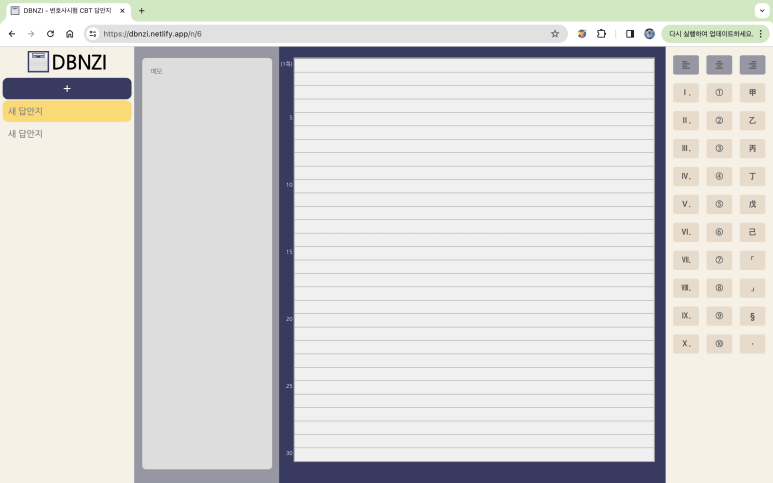
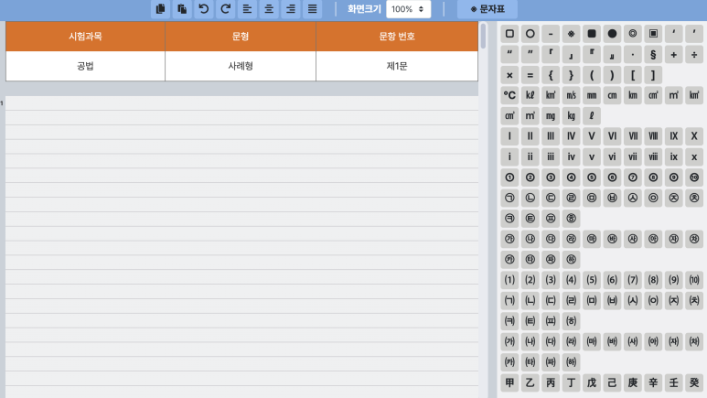
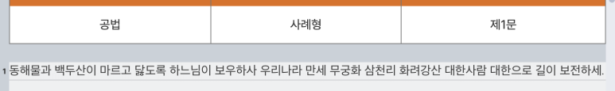

로스쿨 입학을 몇 주 앞둔 요즘, 집에서 선행만 하긴 심심하기도 해서 다시 VScode를 켰다.

https://dbnzi.com

(업데이트 중, 해상도 가로 1920 이상에서 정상 작동 / QHD, 4K는 배율 확대 조정 필요)

---

## 무엇을 만들어 볼까?

올해 1월 시행되었던 변호사시험부터 CBT로 전환되었다. 변리사 시험을 준비하면서 다시는 못할 짓이라고 생각했는데... 다행히도 이제 팔에 불이 날 일은 없을 것 같다.

변호사시험의 사례형에 한하여 CBT로 시험을 치르는데, 방식은 간단하다. 그냥 워드프로세서 작성하듯이 정해진 답안지 양식에 맞추어 수기형 시험 때 했던 대로 답안을 작성해나가면 된다.

[변호사시험 컴퓨터기반 논술형 답안 작성 프로그램 튜토리얼](https://mojb.uwayapply.com/tutorial/pop.htm#/) : 변호사시험 컴퓨터기반 논술형 답안 작성 프로그램 튜토리얼 본 서비스는 법무부 변호사시험 컴퓨터기반 논술형 답안작성(CBT) 프로그램에 관한 안내 및 유의사항 숙지, 조작법 등을 체험함으로써 응시자가 변호사시험 CBT에 적응할 수 있도록 돕는 서비스입니다. 아래의 튜토리얼 시작 버튼을 클릭하시면 튜토리얼을 진행하실 수 있습니다. - 튜토리얼 프로그램 이용 시 유의사항 안내 - 본 변호사시험 CBT 프로그램(소프트웨어) 튜토리얼을 불법으로 다운로드 받거나 무단 복제, 전송, 배포, 도용 등의 행위를 할 경우 저작권법 등에 따라 처벌 받...

법무부에서 위와 같이 CBT 체험 사이트를 제공하고 있다. 궁금해서 더 찾아보니 실제 시험에도 저런 웹사이트를 이용하는 것은 아니고, 시험장 안에 비치된 노트북에 설치된 자체 프로그램을 통해 작성하고 중앙 서버로 답안지를 전송하는 시스템인 것 같다. 즉 위의 사이트는 그걸 최대한 가깝게 모방한 웹 앱 정도로 생각하면 되겠다.

문제는, 변호사시험이 CBT로 전면적으로 바뀌었음에도 그것을 연습할 만한 프로그램이나 앱은 없다는 것이다. 주변에 물어본 결과 실제로 위의 CBT 체험 사이트에서 사례형 연습을 하거나, 한글파일의 서식을 적당히 조절하여 활용한다고 한다.

사례형 시험을 연습할 때 정확한 답안지 양식은 매우 중요한 요소이다. 답안지 한 줄에 들어가는 글자 수, 한 페이지당 줄 수 등을 실제 시험과 동일하게 설정하고 연습해야 답안 분량을 수월하게 조절할 수 있다.

그런 의미에서, 실제 변호사시험 CBT와 동일한 환경에서 사례형 문제 연습을 할 수 있는 사이트를 만들면 좋겠다고 생각했다. 더구나 변시에 발맞추어 로스쿨 내신도 CBT로 전환될 수 있다고 하니, 만들어두면 여러모로 도움이 될 것이다.

법무부의 변호사시험 CBT 체험 사이트에서 연습할 때 발생하는 불편한 점을 개선하고, 답안지 저장기능 등 추가적인 기능을 점차 탑재해나가는 것을 목표로 하였다.

---

## 스케치

우선, 변호사시험 CBT 사이트에서 제공하는 주된 기능은 2가지다.

- 답안지
- 특수문자 입력기

답안지는 한 라인당 애국가 1절이 꽉 차게 들어가고, 답안지 한 면당 30줄이 들어간다. 또한 답안지 좌측에 5줄마다 몇 번째 줄인지 표시해주는 가이드가 있으므로, 이도 구현해주어야 한다.

`<textarea>` 태그에 적절히 배경을 CSS로 구현할까 싶었지만, 그럴 경우 중앙정렬/좌측정렬 기능을 이용할 수 없다. 따라서 이는 그냥 `
` 태그에 contenteditable 속성을 부여하는 방식으로 구현하면 될 것 같았다.

특수문자 입력기능은, 그대로 따오기 보다는 자주 쓰는 특수문자만 따오면 될 것 같다고 생각하였다. 위 사진의 가령 (가) 나 (1) 같은 특수문자는 마우스로 문자표를 누르는 것 보다 키보드로 치는게 더 빠르다. 따라서 갑자들이나, 가운데 표시 점(・) 처럼 자주 쓰이고 입력이 어려운 문자만 따오고자 했다.

그리고, 추가적인 기능으로 저장 기능을 구현하고자 했다. 답안지를 작성하고 브라우저를 닫고 다시 사이트를 열어도 유지되도록 하고 싶었는데, 처음에는 그렇게 하려면 당연히 서버가 있어야 된다고 생각했다.

그런데 생각보다 그거 설정하기도 귀찮고(가장 최근에 DRF로 API 서버 만든게 벌써 2년도 넘었다...), 서버비도 막상 만만치 않게 나갈게 뻔해서 사용자 브라우저 localStorage에 저장하기로 결정했다.

그래도 결국 서버가 있어야 데이터 보관에 대한 안정성이 보장되기 때문에, 나중에 여유가 되면 서버를 만들긴 해야겠다... 라고 생각만 하고 있다!

---

## 개발 스택

[프론트엔드]

결국 서버 없이 돌아가는 정적 사이트로 충분하기 때문에, React.js를 써서 SPA 느낌으로 만들기로 결정했다.

React.js를 처음 접한건 한 2년 전이었는데, 벨로퍼트님의 강의 한 절반정도 듣고 접고, 또 작년에 변리사 연수가서 심심할때 잠깐 하다가 또 접고 해서 아주 기본적인 내용(state, reducer, styled component 등)만 알고 있는 상태였다.

그래서 이왕 이렇게 된 김에 벨로퍼트님의 강의(https://react.vlpt.us/)를 완독하고 개발에 착수하기로 했다. 단, 처리하게 되는 state가 그렇게 많지는 않다고 생각해서 리덕스 부분은 보지 않았다(그러나 지금은 후회하고 있다...).

[백엔드] (추후 개발 예정)

localStorage에 저장된 답안지 데이터들을 rest api를 이용해 중앙 서버와 동기화하는 방식으로 저장할 계획이다. 나에게 가장 편한 DRF(Django Restful Framework)를 써서 구현할 예정이다.
​