<aside>본 글은 필자가 2019년 작성한 A Review of "Neural Style Transfer: A Review" - 1, 2, 3 총 3편을 하나로 엮은 글입니다. 본래 Taxonomy의 나머지 부분인 MOB-IR에 대한 설명과 함께 4편을 마무리해야 했으나, 입대를 하는 바람에 미완성 상태로 남게 되었습니다. 2025년 기준으로 NST 동향을 찾아보면 Diffusion 기반 방식들이 대세로 자리잡은 듯 합니다. NST 최신 동향에 대한 Gemini-2.5 Pro의 답변을 글 맨 아래에 첨부하였습니다. </aside>

--- 

# Introduction to NST and a brief history of style transfer

## Neural Style Transfer(NST)
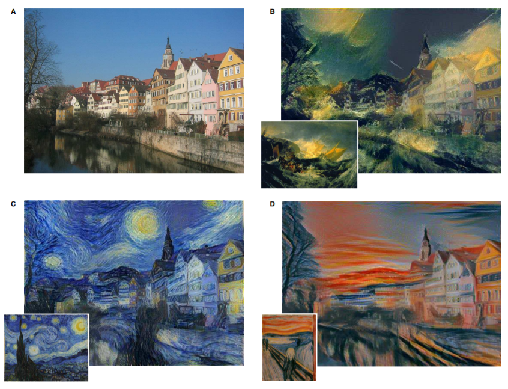
*출처: Image Style Transfer Using Convolutional Neural Networks, Gatys et al.*{:.caption}

학문이 예술과 결합하는 것은 즐거운 일이다. 쇠라의 점묘화에서 빛의 회절 원리를 찾아내거나, 음계를 파동의 공명 현상과 연결지어 이해하는 행위들은 과학에 생기를 불어넣어준다. 그 뿐만 아니라 이런 식의 접근은 새로운 학문을 접할 때 흥미를 갖게 해주기도 한다. 딥러닝에서 이런 역할을 하는 것을 꼽으라면 단연 NST를 예로 들 수 있다. 작년 겨울 cs231n 강의를 들으면서 가장 기억에 깊게 남았던 것이 NST로 만든 고흐 스타일의 그림일 정도로 매력있는 분야였다.

Style Transfer는  이미지의 Content는 유지하면서 Style을 바꾸는 방법을 말한다. 위 그림을 예로 들면, 원본 이미지(A)의 Content(주택, 강, 하늘)은 그대로 유지하면서 그 스타일을 다르게 하여 이미지를 생성하는 것이다(B: 윌리엄터너, C: 고흐, D: 뭉크). Style Transfer중 Neural Network를 이용하는 것을 Neural Style Transfer(NST)라고 부르며, 특히 CNN(Convolutional Neural Network)이 발견은 Style Transfer에 큰 발전을 가져왔다. 이 글을 포함한 앞으로 이어질 글들에서 2017년에 나온 Review Paper *Neural Style Transfer: A Review* 를 읽고 요약, 구현을 하며 Style Transfer에 대한 Greedy Study를 하고자 한다.

**[Review Paper Link](https://arxiv.org/abs/1705.04058)**

## Style Transfer Without Neural Networks
NST가 있기 이전에도 이와 관련된 연구는 20년 넘게 진행되어 왔다. 그 당시에는 NPR(non-photorealistic rendering)이라는 이름으로 불렸다. AR(Artistic Rendering), 그 중에서도 2D 이미지에 대한 AR을 뜻하는 IB-AR 중 NST가 등장하기 이전, 즉 Neural Network(Especially CNN)를 이용하지 않는 알고리즘들에 대해 알아본다.

"IB-AR techniques without CNN" 크게 다음 4가지 분야로 나눌 수 있다.

- Stroke-Base Rendering
- Region-Based Techniques
- Example-Based Rendering
- Image Processing and Filtering

### Stroke Based Rendering
Stroke-based rendering(SBR)은 화가가 그림을 그리듯이, 캔버스를 선으로 채워서 원본 이미지를 기반으로 한 Artistic한 이미지를 생성하는 방식이다. 선을 무엇으로 정하냐(brush strokes, tiles, and stipples, etc.)에 따라 다양한 스타일의 이미지를 생성할 수 있다. 사람이 그림을 그리는 방식과 가장 유사하기 때문에 이미 존재해왔던 스타일(유화, 수채화, 스케치 등)을 효과적으로 표현할 수 있다는 장점이 있으나, 표현할 수 있는 스타일이 그것들에만 국한된다는 단점이 있다.

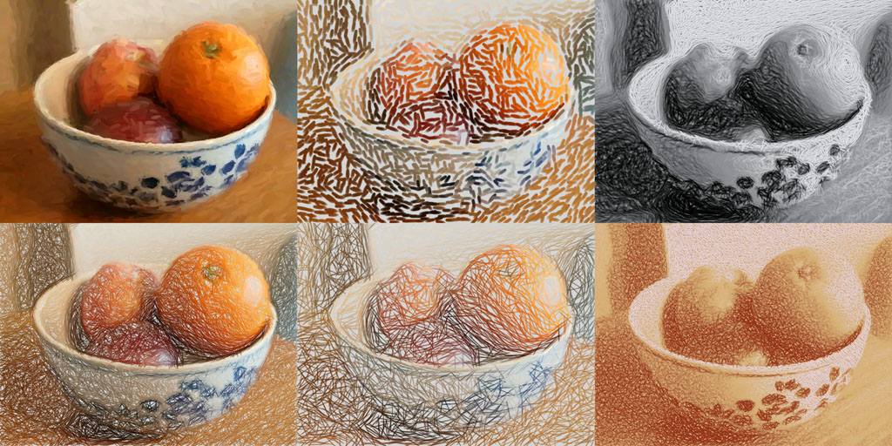
*출처: http://www.fordartworks.co.uk/*{:.caption}

### Region-Based Techniques
Region-Based Techniques는 원본 이미지을 특정 영역으로 나눈 다음(Segmentation), 각 영역마다 특정한 Stroke를 채워 넣어서 이미지를 생성하는 방식이다. 영역을 세분화 하여 각 영역마다 다른 Stroke Style을 적용하여 디테일을 잘 표현할 수 있다는 장점이 있지만, 아래 그림과 같이 각 영역이 대응되어야 잘 표현되기 때문에 다양한 스타일을 유연하게 표현할 수 없다는 단점이 있다.

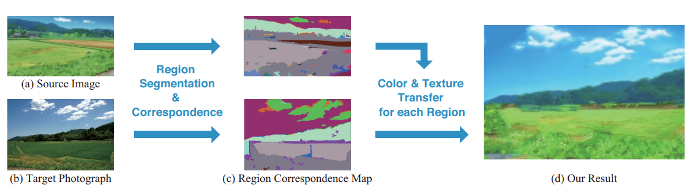
*출처: Region-based painting style transfer, Shugo et al.*{:.caption}

### Example-Based Rendering
Example-Based Rendering은 일종의 Supervised-Learning으로써, 이를 처음 제시한 Hertzmann의 논문 *Image Analogies(2001)* 에 삽입된 아래 그림으로 단번에 이해할 수 있다. Image-Artistic Image의 Pair로 이루어진 Training Data들을 통해 그 관계를 파악하여 다른 이미지에도 이 규칙을 적용한다. Image Analogies는 다양한 Artistic한 스타일에 대해서 효과적이지만 Training Data를 구축하는 것이 어렵고, High-level Feature에 대해 학습이 어렵다는 단점이 있다. 눈치가 빠르다면 알겠지만 Neural Style Transfer는 Example-Based Rendering에 속하며, 따라서 Example-Based Rendering은 Image Analogies와 NST 두 갈래로 나뉜다고 볼 수 있다.

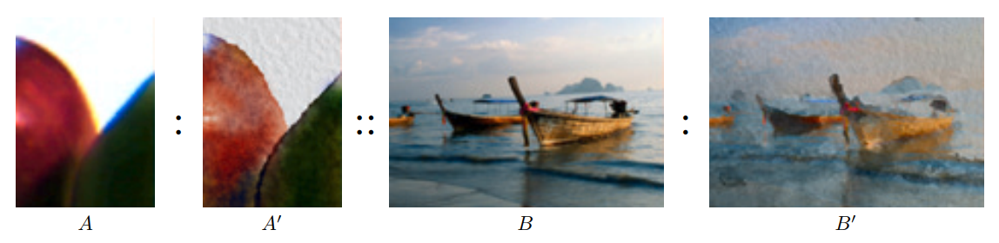
*출처: Image Analogies, Hertzmann et al.*{:.caption}

### Image Processing and Filtering
원본 이미지에 단순히 필터를 씌우는 등의 처리를 하여 이미지를 생성하는 방식이다. Blurring filter 등이 이에 속하며, 필터링 알고리즘들은 일반적으로 straightforward하기 때문에 구현이 쉽고 간단하다는 장점이 있지만, Style Diversitiy 측면에서 매우 제한되어있다는 단점이 있다.

## Summary
종합해보면 위에 소개된 Style Transfer Without Neural Network들은 각각의 장점들을 가지고 있으나 flexibility, style diversity, 그리고 effective image structure extraction 등에 대해서 한계점을 가지고 있다. 기존의 방식들에 대한 이러한 한계점들이 Neural Style Transfer(NST)가 탄생한 배경이 되었다.

--- 

# What is "Style" and "Content"?

## Derivations of Neural Style Transfer
Style Transfer를 수행하기 위해 이미지에서 크게 두 정보를 추출하게 된다. 하나는 **Style** 이며, 다른 하나는 **Content** 이다.

Style은 어떤 이미지의 (Artistic Image로 한정하면)화풍을 의미한다. 고흐와 피카소의 그림에는 명확한 화풍의 차이가 있듯, Artistic Image에는 구별할 수 있는 Style이라는 정보가 존재한다고 가정하며 이를 모델링하는 기법을 **Visual Style(Texture) Modelling** 이라고 한다. 이런 Style을 다양한 이미지에 입히는 것이 Style Transfer의 목적이므로, 가장 중요한 요소라고 할 수 있다.

Content는 어떤 이미지의 내용을 의미한다. 예시로 강가의 주택가 사진에 고흐의 화풍을 입힌 Style Transfer 결과물을 보면, 생성된 이미지에서 고흐의 Style 뿐 아니라 원래 이미지의 내용이었던 강가, 주택 등이 남아있음을 볼 수 있다. 이미지의 Content는 유지한 채 Style만 Transfer하는 것이 Style Transfer의 목표이며, 이렇게 Image의 Content를 유지하는 방법을 **Image Reconstruction** 라는 이름으로 다루고 있다.

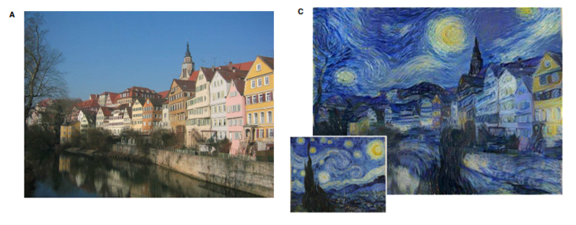{:width="90%" .center-image}

### Visual Texture Modelling
이미지의 Style은 Texture와 매우 깊게 연관되어 있으며, 그에 따라 예전부터 Visual Style Modelling 보다는 Visual Texture Modelling이라는 이름으로 연구가 진행되어왔다 여기에는 두 가지 연구 방향이 있는데, 바로 **Parametric Texture Modelling with Summary Statistics**, 그리고 **Non-parametric Texture Modelling with Markov Random Fields (MRFs)** 이다.

#### Parametric Texture Modelling with Summary Statistics
Parametric Texture Modelling with Summary Statistics(이하 PTM) 는 이미지의 한 부분에서 통계적인 정보들을 뽑아내어 그 부분의 Texture를 대표하는 값으로 정하는 방법이다. 예를 들어, 굉장히 균일하고 매끈한 Texture 부분에서 Pixel들의 분산을 구한 것과, 울퉁불퉁하고 거친 Texture 부분에서 Pixel들의 분산을 구하면 대체로 전자의 값이 작을 것이다. 이처럼 통계적인 값을 Texture를 모델링하기 때문에 *with Summary Statistics* 라는 말이 붙었다.

Parametric이라는 접두사가 붙은 이유는 Parametric vs. Nonparametric Test의 차이에서 기인한 듯 한데, 구체적으로 왜 이런 이름이 붙었는지는 아직 이해를 하지 못했으므로 대신 Parametric과 Nonparametric test에 대한 아래 글을 첨부한다.

[글: Difference Between Parametric and Nonparametric Test](https://keydifferences.com/difference-between-parametric-and-nonparametric-test.html)

Gram-based representation은 Neural Style Transfer에서 가장 많이 쓰이는 방법 중 하나이지만, 이는 이미지의 전체적인 Style만 관측 가능하다는 문제점이 있어 반복적인 패턴이나 가로/세로로 긴 패턴의 Style에 대해서는 적합하지 않다. 그리하여 이를 개선하기 위해 Transformed Gramian을 적용하여 Long-range symmertric structure에 대해 문제점을 개선했다(Berger and Memisevic, 2016).

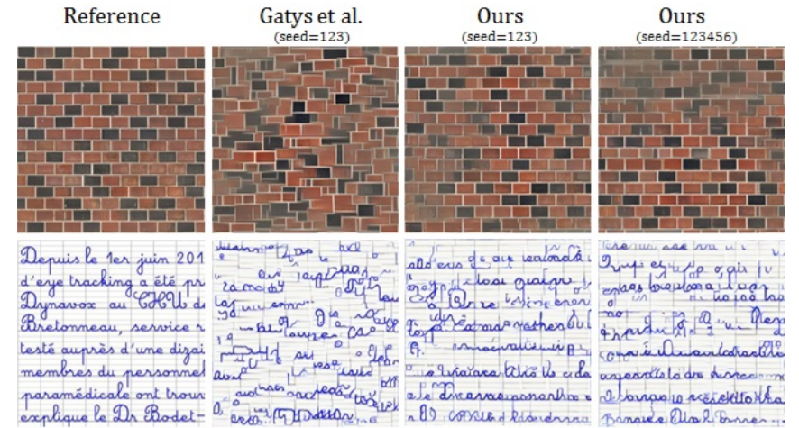{:width="90%" .center-image}
*Gram matrix(Gatys et al.)와 Transformed Gram matrix(Ours)의 비교*{:.caption}

#### Non-paramatric Texture Modelling with Markov Random Fields(MRFs)
Non-paramatric Texture Modelling with Markov Random Fields(MRFs)는 MRFs Model에 기반하여 이미지의 각 픽셀을 주변 픽셀의 정보에 따라 charaterize하는 방식으로 Modelling을 한다. 본 리뷰 페이퍼에서 이 부분에 대한 자세한 설명은 하지 않아 [Efros와 Leung의 논문](https://www2.eecs.berkeley.edu/Research/Projects/CS/vision/papers/efros-iccv99.pdf)으로 설명을 대체한다.

### Image Reconstruction
이미지의 content, 즉 abstract representation을 추출하는 것은 많은 Computer Vision 분야에서 중요하게 다뤄지는 이슈이다. 그것의 역과정으로 잘 추출된 content를 바탕으로 다시 Image를 생성하는 과정을 Image Reconstruction(IR)이라고 한다. abstract representation을 CNN representation으로 한정하면, IR은 IOM-IR, MOB-IR 두 갈래로 나뉜다.

#### Image-Optimisation-Based Online Image Reconstruction(IOB-IR)
IOM-IR은 일반적으로 Random Noise 이미지에서 시작하여 원하는 Style과 Content가 나올 때 까지 iterative하게 gradient descent를 하는 방식으로 이미지를 생성한다. 이미지를 하나 하나 가내수공업 하듯이 iterate하며 만들기 때문에 Image Quality는 상대적으로 높지만, inference time이 상당히 오래 걸린다는 단점이 있다.

#### Model-Optimisation-Based Offline Image Reconstruction(MOB-IR)
Inference time의 문제를 해결하기 위해, MOB-IR은 네트워크를 미리 학습시켜놓아 실제로 이미지를 생성할 때는 네트워크에 통과시키기만 하면 되는 방식이다. IOM-IR이 가내수공업이었다면 MOB-IR은 주물(鑄物)을 미리 만들어놓고 찍어내는 것이다. 이미지를 생성하는데 걸리는 시간과 부하를 Training time에 전가하는데에 의미가 있으며, 최근에는 GAN과 결합하여 좋은 성능을 보여주고 있다.

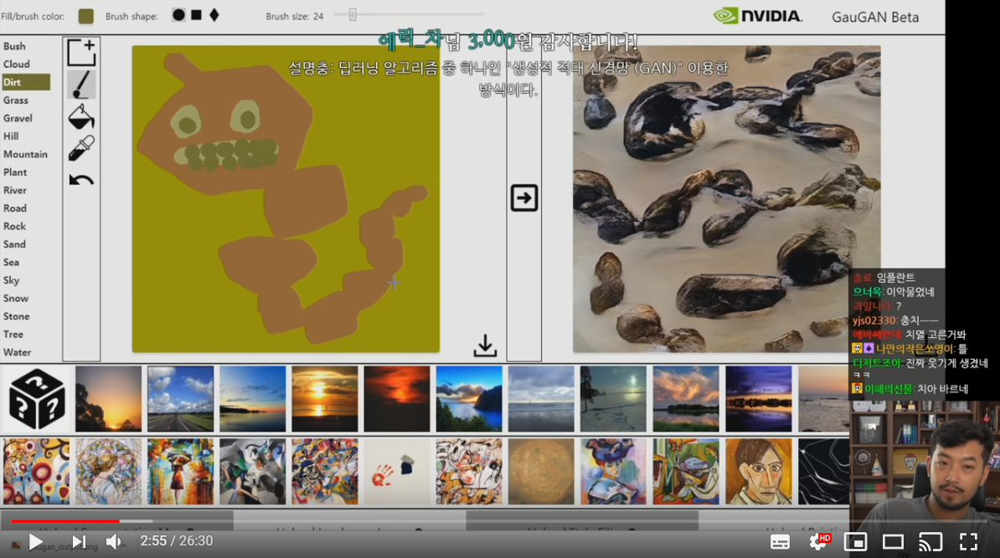{:width="80%" .center-image}
*올해 초 공개되어 큰 반향을 불러일으켰던 NVIDIA의 GauGAN Style Transfer*{:.caption}

## Summary
Style Trasfer의 두 가지 축이라고 할 수 있는 Style과 Content에 대해 알아 보았다.

Neural Style Transfer의 Taxonomy는 크게 IOB-IR, MOB-IR 두 축으로 나뉘는데, 두 방법 모두 다양한 연구들을 통해 발전이 이루어지고 있다. 다음 포스트에서는 NST의 Taxonomy에 대해 좀 더 구체적으로 다루면서 최근에 어떤 연구들이 있었는지에 대해 이야기 할 예정이다.

---

# A Taxonomy of NST: IOB-IR

## Contents

- Image-Optimisation-Based Online Neural Methods
  - Parametric Neural Methods with Summary Statistics
    - Gatys et al, "A Neural Algorithm of Artistic Style", 2015.
    - Li et al, "Demystifying Neural Style Transfer", 2017.
    - Li et al. "Laplacian-Steered Neural Style Transfer", 2017.
  - Non-parametric Neural Methods with MRFs

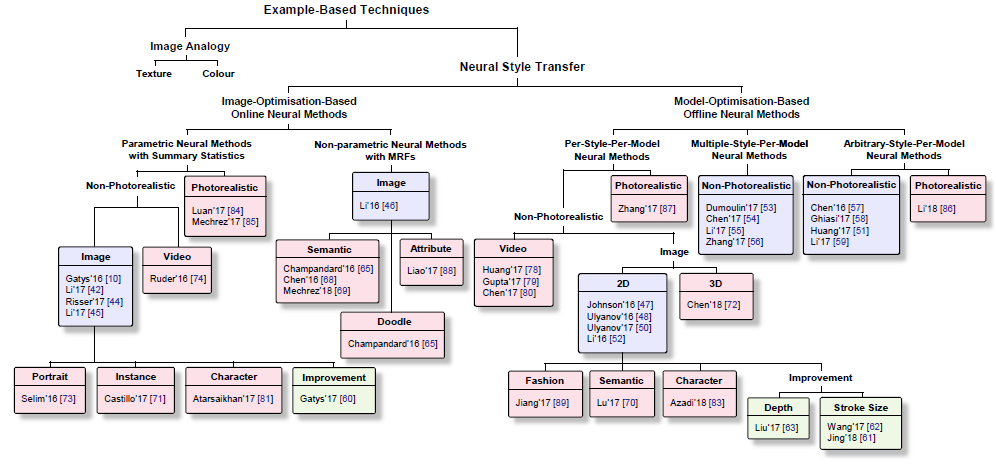{:width="90%" .center-image}

위 그림에서 볼 수 있듯, NST 알고리즘들은 크게 IOB-IR, MOB-IR로 나눌 수 있다. 이번 글에서는 그 중 IOB-IR 알고리즘들을 대표적인 논문들을 통해 알아본다.

## Image-Optimisation-Based Online Neural Methods

### Parametric Neural Methods with Summary Statistics

Parametric IOB-IR 알고리즘의 핵심은 생성할 이미지의 Style Information은 Style Image에 맞추고, Content Image는 Content Image에 맞추는 것이다. 그에 따라 각각의 "Information"을 어떻게 추출할지에 대해 주로 연구가 되어왔다.

#### Gatys et al, "A Neural Algorithm of Artistic Style", 2015.

[Arxiv Link](https://arxiv.org/abs/1508.06576)

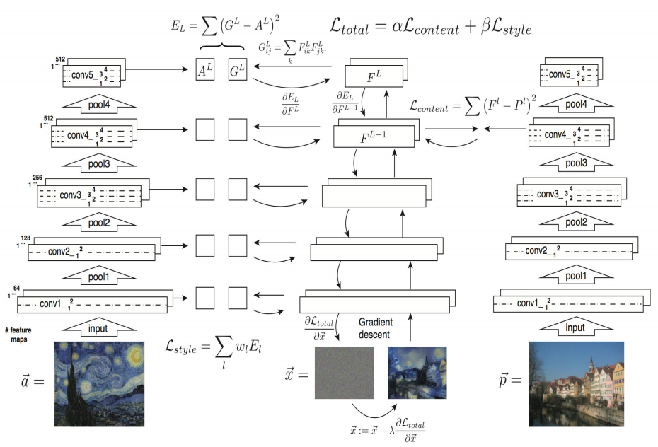{:width="90%" .center-image}

NST의 효시격 논문인 이 논문에서는 \\(I_{output}\\), \\(I_{content}\\), \\(I_{style}\\) 세 이미지에 대해 다음과 같은 Loss Function을 정의한 뒤, 이 Loss를 최소화시키는 방향으로 \\(I_{output}\\) 를 optimize한다.

\\[L_{total} = \alpha L_{content} + \beta L_{style} \\]

 \\(L_{content}\\) 와 \\(L_{style}\\) 은 다음과 같이 정의된다.

$$ L_{content} = {1 \over 2} \sum(F_l - P_l)^2 $$

$$ L_{style} = \sum{1 \over {4N_l^2M_l^2}}(Gram(F_l) - Gram(P_l))^2 $$

- \\(F_l\\): \\(I_{output}\\) 를 VGG Network의 통과시켰을 때,  \\(l\\)번째 레이어의 feature map
- \\(P_l\\): \\(I_{content}\\) 를 VGG Network의 통과시켰을 때,  \\(l\\)번째 레이어의 feature map
- \\(S_l\\): \\(I_{style}\\) 를 VGG Network의 통과시켰을 때,  \\(l\\)번째 레이어의 feature map

\\(Gram(X)\\) 는 주어진 행렬 X에 대한 Gram matrix를 의미하며, feature map의 경우 \\(C \times W \times H\\) 3-dim array이기 때문에 \\(C(=N_l) \times HW(=M_l)\\) 로 reshape하여 Gram matrix를 계산한다. 이때, 행렬 X에 대한 Gram matrix는 다음과 같다.

$$ G_{ij} = \sum_k X_{ik}X_{jk} $$

더 쉽게 표현하면, \\(Gram(X) = X \cdot X^T\\) 이다.

이 논문에서는 \\(l\\), 즉 각 Loss를 계산할 때 어떤 layer를 선택했는지가 중요한 요소라고 한다. 기본적으로 \\(L_{content}\\) 를 계산할때는 \\(conv4\_2\\), \\(L_{style}\\) 에서는 \\(\{conv1\_1, conv2\_1, conv3\_1, conv4\_1, conv5\_1\}\\) 을 사용했으며(relu까지 포함), 네트워크는 pretrained VGG19를 사용하며, 이 네트워크는 업데이트되지 않고 오직 \\(I_{output}\\) 만 업데이트된다.

\\(\alpha\\) 와 \\(\beta\\) 의 비율을 어떻게 하느냐에 따라 \\(I_{output}\\) 이 \\(I_{content}\\) 에 가까운지, \\(I_{style}\\) 에 가까운지가 결정되는데, \\(\alpha / \beta\\) 비율을 크게할 수록 이미지의 윤곽이 살고 작아질수록 스타일이 강해지는 것을 볼 수 있다.

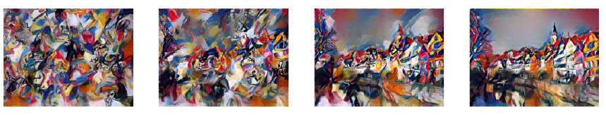{:width="90%" .center-image}
왼쪽부터 \\(\alpha / \beta = 10^{-5}, 10^{-4}, 10^{-3}, 10^{-2}\\) {:.caption}

그 외 특이 사항으로는, VGG19 Network은 원래 Max pooling을 사용하나 Average pooling으로 이를 대체하였을 때 더 좋은 이미지 결과가 나왔다고 한다.

**Contributions**
- Ground truth 없이 style transfer를 수행
- Style image에 특별한 제한을 두지 않고도 수행이 가능

**Limits**
- Content image의 fine structure와 detail을 표현하지 못함
  - CNN의 feature extractor가 low-level feature를 잃어버리기 때문
- Photo-realistic한 style transfer는 불가능
- 다양한 형태의 획과 칠을 표현하지 못하고, content image의 depth information을 잃어버림 (depth information이 무엇인지는 더 찾아 보아야 할 듯)
- Gram matrix가 왜 Style representation을 나타내는지 자세히 밝히지 못함

Gatys의 알고리즘은 Baseline으로 주로 사용되기 때문에 다소 길게 요약하였다.

#### Li et al, "Demystifying Neural Style Transfer", 2017.

\\(I_{output}\\) 과 \\(I_{style}\\) 의 feature map에 Gram matrix를 씌운 값의 차이를 최소화 시키는게 왜 두 이미지의 Style을 비슷하게 만들까? 이에 대해 수학적으로 분석하고, 더 나아가 Gram matrix 외에도 다른 방법론을 제안한 논문이 Li의 논문 *Demystifying Neural Style Transfer* 이다. Gram matrix의 역할이 \\(I_{output}\\) 과 \\(I_{style}\\) 의 feature map의 distribution을 비슷하게 만드는 것임을 수학적으로 증명했다.

자세히 말하자면 MMD(Maximum Mean Discrepancy)를 최소화 시킴을 증명했는데, MMD는 두 분포 사이의 차이를 나타내는 측도로 KL-Divergence 등과 비슷한 맥락에 속한다. 이를 아주 간단히 설명하면 다음과 같다. 어떤 두 분포 \\(p\\) 와 \\(q\\) 가 있을 때, 이 둘이 서로 같을 필요 충분 조건은 임의의 함수 \\(f\\)에 대해 f(sample)의 기댓값이 같아야 한다는 것이다. 따라서, 이 두 기댓값의 차이를 MMD로 정의하며, 이를 두 분포 \\(p\\) 와 \\(q\\) 의 차이로 정의한다.(엄밀한 정리는 아래 사진에 있으며, 도움이 될 자료도 [첨부](https://www.stat.cmu.edu/~ryantibs/journalclub/mmd.pdf)한다.)

여하튼 MMD를 정의하기 위해서는 함수 \\(f\\)(=커널 $k$)가 정의되어야하는데, Gram matrix는 이 kernel이 qudratic polynomial인 경우이며, 따라서 Gram matrix를 사용하는 것은 \\(I_{output}\\) 과 \\(I_{style}\\) 간의 MMD를 줄이는 효과를 가져왔다는 것이다.

MMD만 같게 하면 Style을 비슷하게 할 수 있다는 것에 착안해 다른 kernel(linear, gaussian, BN)들을 사용해 이들 경우에도 Style transfer가 잘 구현됨을 보였다. 이를 통해, DL에서 중요한 영역인 interpretation을 NST에 대해서도 설명할 수 있게 되었다는 의미가 있다.

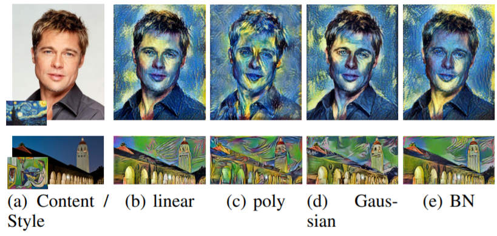{:width="90%" .center-image}

**Contributions**
- Gatys의 알고리즘이 어떤 원리로 작동하는지 수학적으로 증명
- Image feature의 distribution 차이를 줄이는 것이 stylization의 한 방법임을 제시

**Limits**
- Gatys의 알고리즘이 가지고 있는 문제점들을 해결하지는 못함

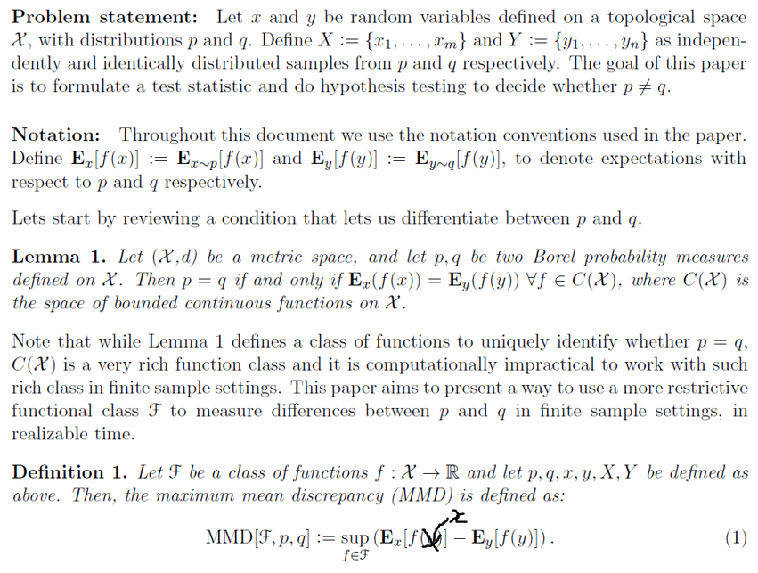{:width="90%" .center-image}
*The definition of MMD*

#### Li et al. "Laplacian-Steered Neural Style Transfer", 2017.

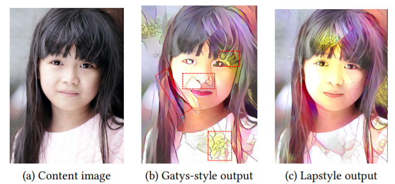{:width="90%" .center-image}

Gatys의 알고리즘은 Content Image의 형태를 왜곡하는 현상이 있었다. 이를 보완하기 위해 Li는 \\(L_{style}\\), \\(L_{content}\\) 에 이어 Laplacian Loss $L_{laplacian}$ 을 추가했다.

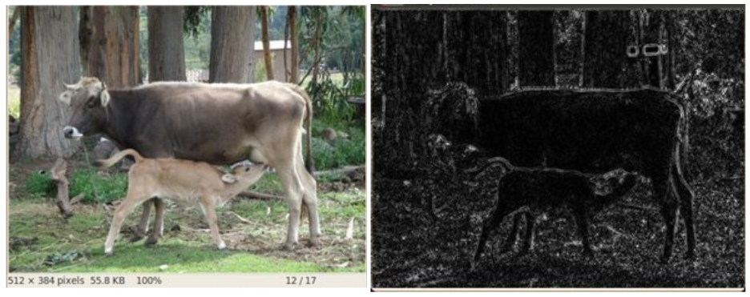{:width="90%" .center-image}

원본 이미지(좌)를 Laplacian filter에 통과 시키면 오른쪽 그림처럼 Edge 부분만 남게 되는데, \\(I_{output}\\) 과 \\(I_{content}\\) 의 Laplacian filter 통과 값의 차이를 추가 Loss Term으로 추가했으며, 식으로 표현하면 다음과 같다($D$는 Laplacian Operator).

$$L_{laplacian} = \sum_{i, j}(D(I_{content}) - D(I_{output}))_{ij}^2$$

이를 통해 Content Image의 형태를 잘 보존할 수 있게 되었다고한다.

### Non-parametric Neural Methods with MRFs

#### Li et al. "Combining Markov Random Fields and Convolutional Neural Networks for Image Synthesis", 2016.

*NST 관련 논문 저자에 이 "Li"라는 이름이 자주 등장해서 NST 분야의 권위자인가 싶었는데, 알고보니 성씨만 같고 다 다른 사람이었다...*

이 논문에서 Style Transfer를 적용하는 방법은 다음과 같다.

1. \\(I_{style}\\) 과 \\(I_{output}\\) 을 pretrained VGG19 Network에 통과시킨다.
2. 생성된 각각의 feature map \\(F_s\\), \\(F_o\\)를 \\(k * k * C\\) patch로 자른다.
3. 각각의 patch set에 속해있는 patch를 서로 일대일 대응 시키는데, 이 때 patch 쌍의  Normalized cross correlation이 가장 작도록한다(이 과정에서도 Network가 쓰인다).
4. 쌍을 이룬 style feature patch들의 L2 loss와 \\(L_{content}\\) 가 최소가 되도록 Image를 optimize한다.

여기서 3번에서의 Patch를 서로 대응 시키는 과정을 Patch Matching이라고 하는데, 이 논문에서는 Patch Matching 과정에 MRF prior를 도입하여 성능을 개선시켰다고 한다. 하지만 MRF에 대해 아직 공부를 하지 못해서 자세히는 모르겠다.

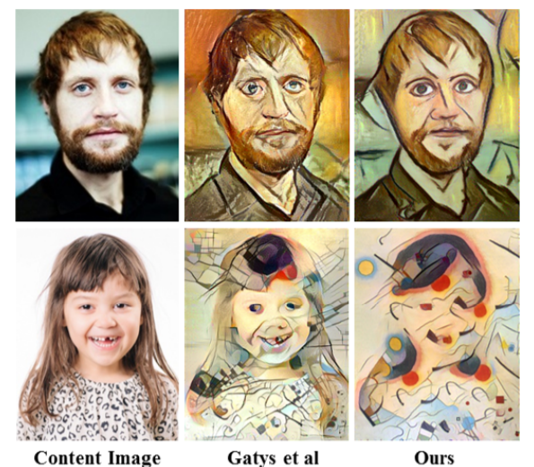{:width="70%" .center-image}

Patch matching은 \\(I_{style}\\), \\(I_{content}\\) 의 비슷한 부분을 매칭하여 stylize를 하는 효과를 가져오기 때문에, Content Image와 Style Image가 비슷한 모양을 가지고 있으면 뛰어난 성능을 보여주며, 특히 photorealistic한 경우에 image distortion이 적게 나타나 현실감있는 이미지를 생성한다. 하지만 같은 이유로 Content Image와 Style Image의 모양이 크게 다르면 잘 작동하지 않는다(위 사진의 두번째 행 참고).

참고로, 이 논문에서 Patch matching을 어떻게 구현했는지 아무리 찾아보려고 해도 논문 상에는 additional conv layer를 사용했다는 말 외에는 별 다른 설명이 없었다. Neural Matching이 원래부터 있던 알고리즘이기 때문에 생략한 것 같기도 한데... MRF NST 알고리즘을 공부하기 위해서는 MRF나 Neural Matching 등 사전 지식에 대한 공부가 많이 필요할 것 같다.

## Summary

NST를 IOB-IR과 MOB-IR로 나누어 볼 때, 비교적 먼저 등장한 개념인 IOB-IR에 대표적인 논문 몇 가지를 살펴 보았다. Gatys의 알고리즘을 Baseline으로 이를 개선하려는 여러 시도들이 있었고, 주로 Loss term을 새로 추가, 수정 하는 방식으로 연구가 되어왔다.

다음 리뷰에서는 IOB-IR의 가장 큰 단점인 Inference Time을 개선할 수 있는 MOB-IR 카테고리에 대해 논문 리뷰와 함께 공부해 볼 예정이다.

--- 

> Q. 2025년 기준 스타일 트랜스퍼 최신 동향?

2025년 현재, 뉴럴 스타일 트랜스퍼(Neural Style Transfer) 분야는 기존의 CNN과 GAN을 넘어 **디퓨전 모델(Diffusion Models)** 이 주도하는 새로운 시대로 접어들었습니다. 이와 더불어 2D 평면을 넘어선 **3D 공간으로의 확장**과 사용자의 의도를 정밀하게 반영하는 **제어 가능성(Controllability)의 향상**이 핵심적인 연구 동향으로 자리 잡았습니다.

---

### ## 🎨 트렌드 1: 디퓨전 모델의 시대

2025년 스타일 트랜스퍼의 가장 큰 변화는 단연 **디퓨전 모델의 전면적인 도입**입니다. Stable Diffusion, Midjourney 등 텍스트-이미지 생성 모델의 기반이 되는 디퓨전 모델은 스타일 트랜스퍼에서도 압도적인 품질을 보여주며 대세로 자리 잡았습니다.

* **압도적인 품질과 안정성:** 디퓨전 모델은 노이즈를 점진적으로 제거하며 이미지를 생성하는 특성 덕분에, 기존 GAN 기반 모델에서 흔히 발생하던 아티팩트(artifact)나 구조적 왜곡이 적습니다. 콘텐츠의 형태를 안정적으로 유지하면서도 스타일의 질감과 색감을 정교하게 표현하는 데 매우 뛰어납니다.

* **학습 없는(Training-Free) 방식의 부상:** `Style Injection`과 같은 최신 연구들은 사전 학습된 거대 디퓨전 모델을 별도의 재학습 없이 스타일 트랜스퍼에 활용합니다. 어텐션 레이어의 키(key)와 밸류(value)를 조작하는 방식으로 콘텐츠 이미지에 스타일을 주입하여, 시간과 비용을 획기적으로 줄이면서도 높은 품질의 결과를 얻습니다.

* **콘텐츠-스타일 분리 기술의 고도화:** 디퓨전 모델 내에서 콘텐츠와 관련된 어텐션 정보는 유지하고 스타일 정보만 교체하는 등, 두 요소의 분리 및 재결합 기술이 더욱 정교해지고 있습니다. 이는 사용자가 원하는 대로 스타일의 강도를 조절하거나 특정 부분에만 스타일을 적용하는 등 세밀한 제어를 가능하게 합니다.

---

### ## 立体 트렌드 2: 3D 공간으로의 확장

스타일 트랜스퍼는 더 이상 2D 이미지에만 머무르지 않습니다. **3D NeRF(Neural Radiance Fields)** 와 **3D 가우시안 스플래팅(Gaussian Splatting)** 같은 새로운 3D 표현 방식의 등장으로, 3D 모델과 공간 전체에 예술적 스타일을 일관되게 적용하는 연구가 활발히 진행 중입니다.

* **다중 시점 일관성(Multi-view Consistency):** 3D 스타일 트랜스퍼의 핵심 과제는 어느 각도에서 보아도 스타일이 깨지거나 어색해 보이지 않도록 일관성을 유지하는 것입니다. 최신 연구들은 2D 디퓨전 모델의 강력한 생성 능력을 3D 공간에 투영하여, 여러 시점에서 렌더링된 이미지들이 모두 일관된 스타일을 갖도록 합니다.

* **의미론적 스타일링(Semantic-Aware Styling):** 단순히 표면에 텍스처를 입히는 것을 넘어, '하늘은 푸른 유화 스타일로', '건물은 거친 벽돌 스타일로' 와 같이 3D 공간 내의 객체를 의미적으로 이해하고 각기 다른 스타일을 적용하는 방향으로 나아가고 있습니다.

---

### ## 🎛️ 트렌드 3: 정교한 제어 기술의 발전

사용자가 결과물에 더 많은 영향력을 행사할 수 있도록 하는 **'제어 가능한(Controllable)' 스타일 트랜스퍼**가 중요한 연구 주제로 부상했습니다.

* **스타일 강도 및 부분 적용:** 슬라이더를 조절하듯 스타일의 강도를 연속적으로 변경하거나, 마스크(mask)를 이용해 이미지의 특정 영역에만 스타일을 적용하는 기술이 보편화되고 있습니다.

* **콘텐츠 디테일 보존:** 스타일을 적용하는 과정에서 원본 콘텐츠의 중요한 디테일(예: 인물의 눈, 코, 입)이 뭉개지는 것을 방지하고 선명하게 유지하는 기술이 고도화되고 있습니다. 멀티 스케일(Multi-scale) 네트워크나 어텐션 필터링 기법이 이를 위해 사용됩니다.

* **다중 스타일 결합:** 두 가지 이상의 스타일 이미지를 참조하여 각각의 특징을 조화롭게 섞는 스타일 퓨전(Style Fusion) 연구도 활발하게 이루어지고 있습니다.

2025년의 스타일 트랜스퍼는 디퓨전 모델이라는 강력한 엔진을 장착하고 3D와 비디오 등 새로운 영역으로 빠르게 확장하며, 동시에 사용자가 창의성을 더욱 자유롭게 발휘할 수 있도록 정교한 제어 기능을 제공하는 방향으로 진화하고 있습니다.