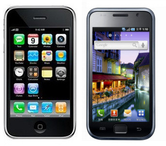
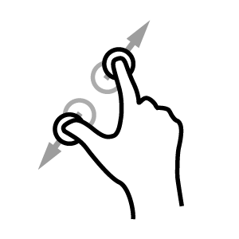
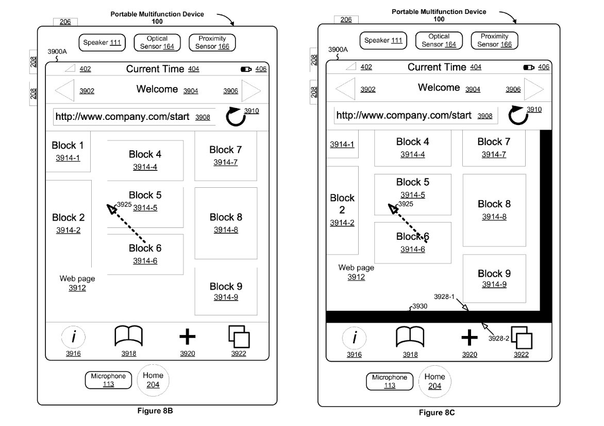
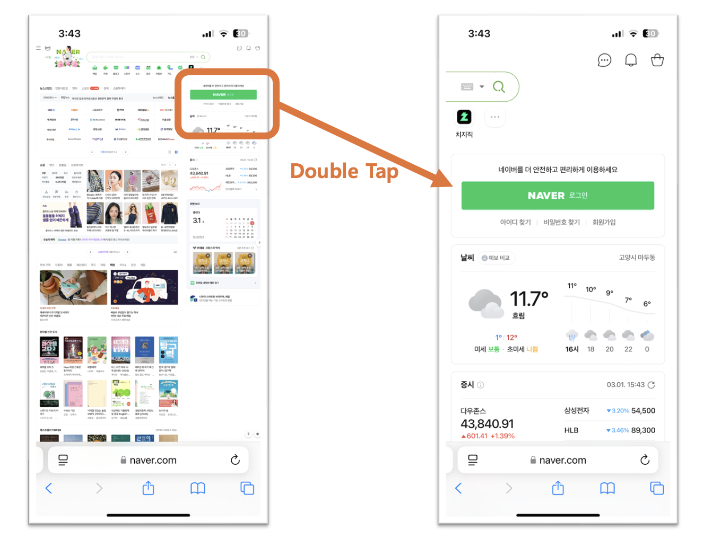

# 스마트폰 특허전쟁

얼마 전 삼성전자의 갤럭시 S25가 출시되었습니다. 2010년 갤럭시 S를 선보인 이래로 보이는 16번째 플래그십 모델이었죠. 애플도 삼성과 같이 매년 새로운 모델을 발표하며 올해도 아이폰 17을 출시할 예정입니다. 

아이폰의 등장으로 스마트폰 시장이 열리고 노키아가 몰락하면서, 삼성과 애플은 시장을 선점하고 현재까지도 1, 2위를 엎치락 뒤치락하며 라이벌 관계를 구축해왔습니다. 한때는 양사의 세계 점유율이 50%를 상회하였고, 2024년 현재도 시장의 40%를 거의 양분하고 있습니다.

긴 경쟁의 시작점에는 경쟁을 넘어선 ‘싸움’이 있었습니다. 2011년 4월 15일, 애플은 삼성이 자사의 특허와 디자인 등을 침해했다고 주장하며 10억 달러 규모의 손해배상청구소송을 제기합니다. 갤럭시 S가 아이폰을 베껴서 만들었으니, 갤럭시 S를 팔아서 얻은 이익을 내놓으라는 것이죠. 이에 맞서 삼성도 자사의 통신 관련 특허를 애플이 침해했다며 반소를 제기합니다. 둘의 법적 공방은 7년이나 지난 2018년에서야 합의로 종결되었습니다. 

싸움의 승자는 누구였을까요? 애플과 삼성은 각각 어떤 주장을 펼쳤을까요? 저도 2011년 당시부터 뉴스를 통해 자주 접했던 사건이었고, 변리사 수험생 시절부터 로스쿨에 와서까지 해당 사건의 중요성을 수도 없이 들어왔지만 그 이상을 알지는 못했습니다. 이번 기회에 그 내막을 파헤쳐보고 안에 있었던 특허법적 쟁점들을 소개하려 합니다.

# 애플의 안방에서, 10억 달러 소송

삼성과 애플의 소송전에는 2011년 애플이 제기한 **1차 소송**과 2012년 역시 애플이 제기한 **2차 소송**이 있었습니다. 1차 소송의 배상액 규모는 약 10억 달러, 2차 소송은 약 1억 달러였습니다. 통상 삼성과 애플이 싸운 소송은 1차 소송을 말하고 그 규모 면에서도 큰 차이가 나기 때문에, 2차 소송은 나중에 기회가 되면 다루고 **1차 소송**에 대해서만 얘기해보도록 합시다.

1차 소송은 미국 캘리포니아 북부에 위치한 산호세에서 시작되어 전 세계로 번져나갔습니다. 독일, 일본, 네덜란드, 그리고 대한민국에서도 소송이 진행되었습니다. 그러다가 2014년 8월에 미국을 제외한 9개 국가에서 진행중이던 특허소송을 모두 철회하기로 합의합니다. 시장의 크기도 작을 뿐더러, 서울중앙지법이 양사의 특허침해를 인정하면서 각각 4천만’원’, 2천5백만’원’의 배상금 지급을 명한 것과 미국에서 청규 규모인 ‘10억 달러’를 비교해보면 미국 밖 다툼의 실효성을 느끼지 못한 것으로 보입니다. 결국, 1차 소송은 **미국 내 소송**만을 가리키게 됩니다.

# 그래서 누가 이겼는데?

그래서 그 1차 소송에서 누가 이겼냐구요? ‘소송’만 놓고 보면 **애플**이 승자로 보입니다. 2011년 애플은 10억5천만 달러의 배상금을 요구했고, 삼성은 2천8백만 달러에 국한되어야 한다고 주장했으나, 2018년 추정컨대 **약 6억 6천만 달러 규모 이상의 배상금**을 삼성이 애플에 주는 것으로 합의하고 분쟁을 종결짓습니다. 이에 반해 애플이 삼성의 특허를 침해했다는 주장은 모두 받아들여지지 않고 끝났습니다. 이렇게 법정에서만 놓고 따진다면 삼성이 패했다고 볼 수 있습니다. 하지만 법정 밖에서도 삼성은 패자일까요?

비즈니스적으로 보면 삼성은 오히려 실보다 득이 많은 패배였습니다. 비록 소송에서는 졌지만, 7년 동안 애플의 라이벌로 지목되며 세계 스마트폰 1위 자리를 차지했습니다. 배상금 7천억원이 커보이기는 하나 삼성전자의 2018년 영업이익이 59조 원임을 고려할 때 감당 못할 수준은 아닙니다. 그것을 대가로 1위의 자리에 오를 수 있다면 더더욱 그럴테죠.

여하튼 비즈니스적인 이야기는 경제기사에서 다루기로 하고, 여기서는 법적인 쟁점에 대해서만 다뤄보도록 합시다. 

# **애플의 공격 : Apple Inc. v. Samsung Electronics Co.**

<aside>
❓ 미국은 판례를 **A(원고) v. B(피고)**와 같이 지칭합니다. 낙태권 관련해서 뉴스에서 자주 등장하는 Roe v. Wade 판결은 Jane Roe(가명)이 원고가 되어 Henry Wade 검사를 피고로 제기한 소였습니다.

</aside>

2011년 4월 15일, 애플은 삼성이 자사의 실용특허, 디자인특허, 트레이드 드레스를 침해하여 갤럭시 S 등 제품을 제작 및 판매했다는 이유로 산호세 지방법원(캘리포니아 북부연방지방법원)에 소를 제기합니다. 실용특허와 디자인, 트레이드 드레스가 어떤 것인지 이야기하기 전에, 소송의 전체적인 골자를 살펴보면 아래와 같습니다.

- **1심 : 캘리포니아 북부연방지방법원**
    - 배심원, 10억5천만 달러 배상금 평결
    - **‘13.11** 담당판사, 배상금 재계산 명령 후 9억3천만 달러 배상금 부과
        - 9억3천만 달러 
        = 1억4천9백만(실용특허 침해분) 
        + 3억9천9백만(디자인특허 침해분) 
        + 3억8천2백만(트레이드 드레스 침해분)
- **2심 : 연방순회항소법원(CAFC)**
    - **‘15. 05** 법원, 애플의 트레이드 드레스를 무효로 보면서 기존 3억8천2백만 달러 부분 파기
    - 실용특허와 디자인특허 침해 부분은 1심 판결을 수용
- **3심 : 연방대법원**
    - **‘16. 12** 법원, 디자인특허 침해분 3억9천9백만 달러 중 일부만이 인정되어야 한다며 해당 부분 파기, 항소법원으로 환송
- **환송심(항소심)**
    - 대법원의 판단을 받아들여 지방법원으로 환송(배상액 산정의 권한은 1심 법원에만 있기 때문)
- **배상액 재산정 : 캘리포니아 북부연방지방법원**
    - 실용특허 침해분은 1억4천9백만 → 530만 달러로 대폭 감소됨.
    - 디자인특허 침해분은 5억3천3백만달러로 오히려 증가함.
        - 디자인특허 침해분이 오히려 증가한 이유는, 트레이드 드레스가 무효화되면서 트레이드 드레스 침해 제품에 대한 배상액(3억8천2백만)이 디자인특허, 상용특허 침해분으로 분배되었기 때문
    - **‘18. 05 총 5억3천9백만 달러 배상 평결** (실용특허 $5,324,050 + 디자인특허 $533,316,606)
- **‘18. 06** 삼성-애플, 합의. 예상 배상금 규모 약 6억6천만 달러 이상

소송의 결과만 한 문장으로 요약하면, **“삼성이 애플의 디자인을 침해하여 6억 달러 넘게 물어줬다.”** 입니다. 트레이드 드레스는 무효화되었고, 실용특허 침해분은 디자인특허에 비하면 무시할 수 있을 만한 수준입니다. 그렇다면 이제 실용특허, 디자인특허, 그리고 트레이드 드레스란 무엇이며 애플은 어떤 특허들을 가지고 있었는지 알아봅시다.

## 실용특허와 디자인특허

미국 특허법은 세 가지 종류의 특허를 규정합니다. 실용특허(Utility Patent), 디자인특허(Design Patent), 그리고 식물특허(Plant Patent)이 있으며 각각 35 U.S.C. 101조, 171조, 161조에서 규정합니다.

<aside>
❓ 미국을 흔히 판례법 국가로 알고 있지만, 그렇다고 법전이 없는 것은 아닙니다. 대표적으로 총 51편으로 이루어진 미 연방 법률을 하나로 모은 U.S. Code가 존재하며 그 중 35편이 특허법에 해당합니다. 이외에도 형사법(18편), 26편(세법) 등이 규정되어 있습니다.

</aside>

실용특허는 “발명”을 권리화한 것으로, 기술적 아이디어를 보호합니다. 그렇기에 발명이 가지는 기능이나 효과가 중시됩니다. 디자인특허는 “디자인”을 권리화한 것으로, 제품의 외관을 보호합니다. 그래서 어떠한 기능을 가질 필요가 없습니다. 미국이 둘을 모두 특허(Patent)라 칭하는 것과 달리 대한민국은 「특허법」에서 발명을 특허권으로, 「디자인보호법」에서 디자인을 디자인권으로 보호하고 있습니다.

소송에서 주로 문제가 된 것은 실용특허 3건(핀치-투-줌, 바운스 백, 탭-투-줌)과, 디자인특허 3건(아이폰의 전체적인 외관 2건, 바둑판식 아이콘 배열 1건)이었습니다.  

## 애플의 “기술”을 삼성이 베꼈는가?  — 실용특허 침해 여부

### 실용특허 ① : 핀치-투-줌(Pinch-To-Zoom)

**US 7844915**(이하 “**’915 특허**”)-“Application programming interface for scrolling operation” 입니다. 

소위 “싱글 핑거 스크롤링 및 투 핑거 줌” 내지는 “핀치-투-줌”으로 부릅니다. 가령 스마트폰으로 뉴스를 볼 때, 한 손가락으로 스크롤을 하고, 기사의 사진을 크게 보려면 두 손가락을 사용하여 벌리듯이 확대하죠. 반대로 축소할 때는 손가락을 꼬집듯이(pinch) 오므립니다.

오늘날 모든 스마트폰에서 볼 수 있는 기능이죠. 물론 삼성의 갤럭시 S를 포함한 대다수 제품들도 해당 기능을 사용하고 있었습니다. 삼성 측은 애플의 특허와 달리 두 손가락으로 스크롤이 된다고 주장하였으나, 재판 중 시연과정에서 두 손가락으로 스크롤을 하자 화면이 확대되어 지적당하기도 했습니다. 결국 1심에서 침해가 인정되었죠.

그러나 최종적으로는 침해가 인정되지 않았습니다. **‘18. 06** 있었던 평결문을 보아도, 아래의 381, 163 특허만 언급될 뿐 915 특허는 빠져있습니다. 소송 도중 미국 특허청에서 해당 특허를 재심사하였는데, **무효 판정**을 받았기 때문이죠.

특허를 받기 위해서는 신규성(기존에 없던 것), 진보성(쉽게 생각할 수 없는 것) 등의 요건을 충족해야 합니다. 그러한 요건은 특허청 공무원인 심사관이 판단하는데, 심사관도 사람인 이상 실수를 하기 마련이죠. 그래서 등록 당시에는 멀쩡한 특허였다가 나중에 누가 문제를 제기하면 소급하여 무효로 되는 일이 종종 있습니다. 그러한 사후적 절차 중 하나인 EPRx(Ex Parte Reexamination)을 통해 2013년 7월, ‘915 특허의 모든 청구항이 무효 판정을 받습니다. 애플이 불복하여 제기한 불복심판도 무효 판정을 지지했죠. 애플 측에서 연방순회항소법원(CAFC)에 항소를 하여 최종 무효 결정은 2020년에서야 확정되었지만, 특허청과 심판원의 결정을 존중하여 1차 소송의 항소심부터는 침해 판단시 ‘915 특허를 침해 대상에서 제외한 것으로 보입니다.

### 실용특허 ② : 바운스 백(Bounce Back)

**US 7469381**(이하 “**’381 특허**”)–”List scrolling and document translation, scaling and rotation on a touch-screen display” 입니다.

별칭인 Bounce Back 단어 그대로, 화면을 스크롤하다 끝에 다다르면 화면이 튀어오르는 효과를 다루고 있습니다. 이는 매우 간단하면서도 강력한 애플의 무기였습니다. 침해제품으로 지목된 21개 제품 모두 침해 판정을 받았고, 해당 특허의 침해는 한국 내 법원에서도 인정되었습니다. 

하지만 삼성 입장에서 다행히도, ‘915 특허가 그랬던 것 처럼 ‘381 특허도 무효 판정을 받습니다. 총 20개의 청구항 중 4개 항을 제외하고 모두 무효 판정을 받았으며, 이러한 사실이 배상액 재산정 시 주요하게 작용했을 것으로 보고 있습니다.

### 실용특허 ③ : 탭-투-줌(Tap-To-Zoom)

**US 7864163**(이하 “**’163 특허**”)-“Portable electronic device, method, and graphical user interface
for displaying structured electronic documents” 입니다. 

웹서핑을 할 때 특정 영역을 더블 탭하면 그 부분을 확대해주는 특허입니다. 요즘에는 대부분의 웹사이트가 모바일 뷰를 지원하고 있어서 확대를 할 일이 별로 없지만, 과거에는 PC 버전 그대로 스마트폰 화면에 나타나 작은 글씨를 읽기 위해 자주 사용하던 기능이었습니다. 

확대를 할 때 얼만큼 확대해야 하는지도 자동적으로 결정됩니다. 웹페이지는 여러 영역들이 박스처럼 나뉘어져 있는데, 그 영역을 탭하면 기기의 가로 폭과 박스의 폭이 일치하도록 확대됩니다. 위 그림에서 로그인 영역을 더블탭하면 오른쪽처럼 그 영역의 박스가 화면에 딱 맞게끔 확대되는 모습을 볼 수 있습니다.

삼성 스마트폰 8개가 ‘163 특허를 침해한 것으로 평결되었습니다. 그리고 ‘915 특허, ‘381 특허와 달리 EPRx를 거치지 않고 모든 청구항이 유효하다는 전제 하에 소송이 진행되었습니다. ‘163 특허의 모든 청구항은 현재도 모두 유효합니다. 

---

나아가 위 세 실용특허는 삼성이 고의적으로 이들을 침해했다고 인정되어 배상액 규모가 급증하였습니다. 이를 **징벌적 손해배상**이라고 하는데, 타인의 특허를 고의로 침해한 경우 손해액의 3배까지 배상액을 물리는 제도입니다. 그래서 1심에서 실용특허 침해로 인정된 배상액은 1억 달러를 상회했죠. 

그러나 소송이 진행되면서 다수의 특허가 무효화되어 실질적으로 탭-투-줌 ‘163 특허만 온전하게 남았고, 그마저도 대부분의 손해액을 디자인특허 침해를 근거로 산정한 까닭에 **결국에는 상대적으로 매우 적은 금액인 530만 달러가량만 실용특허 침해분으로 인정되었습니다.** 반대로 말하면, 이 소송의 핵심은 기술보다는 **디자인**에 있었던 것입니다.

---

"감성의 애플"이라는 말처럼 애플의 디자인특허는 강력했습니다. 이 소송을 통해 디자인 보호의 필요성이 크게 대두되었죠. 하지만 그에 대한 반발도 심했습니다. 애플의 "둥근 모서리 특허"가 삼성 제품을 공격했다는 기사가 쏟아지자 그러면 동그라미, 세모, 네모에도 특허를 내라는 비아냥이 쏟아져나왔고, 언론은 삼성을 애플이라는 거대 기업의 횡포에 맞서 싸우는 국산 기업처럼 묘사했습니다.

그렇다면 정말 애플은 세상의 모든 "둥근 모서리 전자제품"을 독점했을까요? 디자인특허는 이 싸움의 핵심 쟁점인 만큼, 따로 지면을 빼어 다음 글에서 이야기해보고자 합니다. 그리고 그 외의 쟁점인 트레이드 드레스, 삼성의 반격과 ITC 소송에 대해서도 마저 다루어 보겠습니다.
