이전 글에서 애플과 삼성의 소송전에서 주장되었던 애플의 실용특허들을 다루어 보았습니다. 탭-투-줌, 멀티터치 제스쳐(핀치-투-줌), 바운스 백 등 주지의 기술들이 주장되었으나, 최종 배상액 산정에서 큰 비중을 차지하지는 못했습니다. 그 파이를 디자인특허들이 가져간 만큼, 애플의 디자인특허들을 살펴볼 필요가 있습니다.

당시 아이폰의 디자인은 애플의 팬덤을 형성할 만큼 큰 인기였습니다. 기능도 기능이지만 단순히 아이폰이 예뻐서 사는 사람들도 꽤 있었죠. 하지만 삼성과의 소송을 진행하면서, 디자인 독점에 대한 비판 여론도 형성되었습니다.. 특히 "둥근 모서리 직사각형" 디자인을 애플이 독점하였고 그것이 부당하다는 말이 많았습니다. 아무래도 삼성이 한국 기업이니 우리나라 언론은 그러한 점을 더욱 부각했습니다.

이번 글에서는 "둥근 모서리"를 포함한 애플의 디자인과, 그와 유사한 개념인 트레이드 드레스를 살펴보고 소송에서 어떤 영향을 끼쳤는지 알아보도록 하겠습니다.

## 애플의 “디자인”을 삼성이 베꼈는가? — 디자인특허 침해 여부

### 디자인특허 ①

**US D618677**(이하 “**D’677 특허**”)–“Electronic device” 입니다.

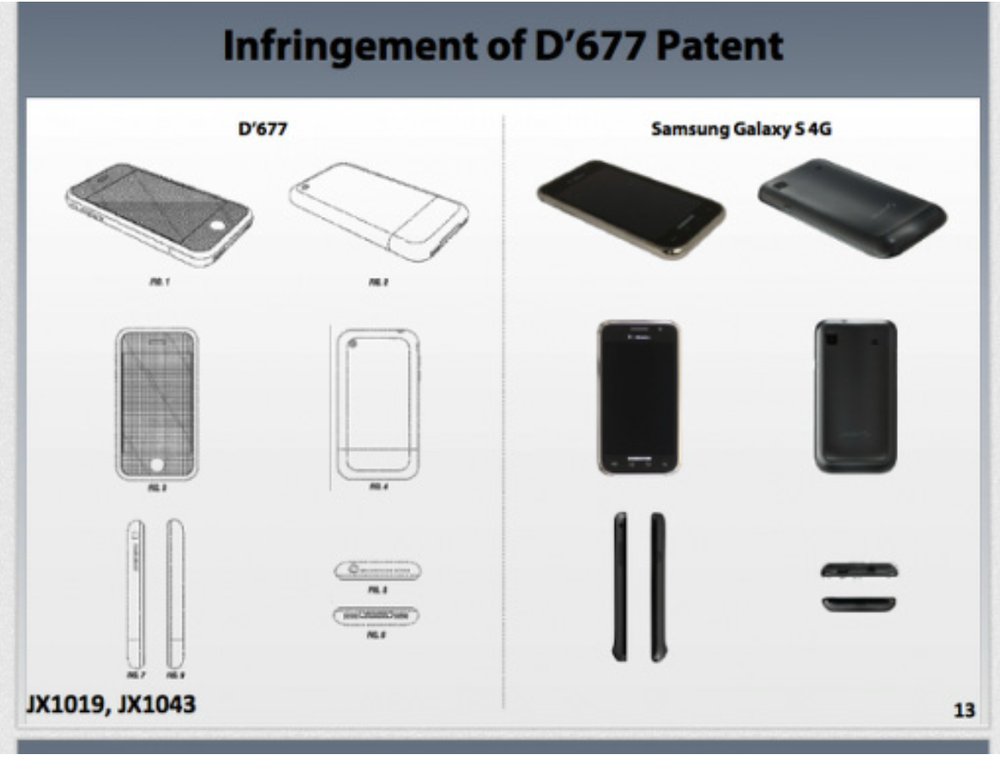

아이폰의 전면부 디자인에 관한 특허입니다. 도면에서 점선으로 표시된 부분은 설명을 위한 표시일 뿐 권리와는 관계가 없습니다. 따라서 홈버튼은 있어도 되고 없어도 됩니다. 권리가 되는 부분은 ①실선으로 색칠된 평평한 엣지-투-엣지 유리, ②상단의 스피커부, ③가운데 디스플레이 경계 정도가 될 것입니다.

앞서 ‘915 특허와 ‘381 특허가 소송 도중 무효 판정을 받은 것처럼, D’677도 두 번의 위기가 있었습니다. **첫번째**는 아래의 D’087 특허와 유사하여 D’677 특허가 무효로 되어야 한다는 삼성 측의 주장이었습니다. D’087 특허도 애플의 특허인데 왜 무효 사유가 되는 것일까요? 바로 보호기간 때문입니다. 디자인특허의 보호기간은 14년(현재는 15년)인데, 만약 같은 사람이 동일하거나 유사한 디자인특허를 매년 낸다면 보호기간이 사실상 무한한 디자인특허를 보유할 수 있게 되는 것이죠. 다만, 그 취지를 고려해 후특허의 존속기간 만료일을 선특허의 존속기간 만료일로 앞당기는 **존속기간 포기서(Terminalr Disclaimer, TD)**를 제출하면 무효사유는 해결됩니다. 애플도 역시 TD를 제출하여 첫번째 무효사유를 해소한 것으로 보입니다.

**두번째** 문제는 비자명성(Non-Obviousness) 요건이었습니다. 디자인특허를 등록받기 위해서는, 기존의 디자인으로부터 자명하게 도출되는 디자인을 넘어 디자이너의 창작이 가미되어야 합니다. 비자명성을 판단하기 위한 선행디자인으로 LG전자와 도시바의 디자인 등 10개의 디자인이 제시되었습니다.  

<aside>
❓ 미국은 실용특허와 디자인특허 모두 비자명성 요건을 등록 요건으로 규정하고 있습니다(35 U.S.C. §103). 반면 우리나라는 특허권의 경우 “진보성”(특허법 제29조 제2항), 디자인권은 “창작비용이성(또는 창작성)”으로 규정합니다. 용어의 차이에도 불구하고 판단 기준 측면 등에서 실용특허의 비자명성은 진보성과, 디자인특허의 비자명성은 창작비용이성과 유사합니다.
</aside>

해당 무효사유와 관련하여 인터넷 기사, 심지어 특허청에서 게재한 자료에도 틀린 내용이 많이 있었습니다. 당장 구글에 “둥근 모서리 특허 무효”라고 검색하면 무효 판정을 받았다는 2015년 8월자 기사들이 쏟아져나옵니다. 최종 결정이 아니라는 단서를 남겨놓은 기사도 있지만, 다수의 기사가 이미 무효로 된 것처럼 표현하고 있습니다.  제가 이 글을 쓰면서 많은 참고를 했던 [특허청의 게시 자료<스마트폰 특허분쟁>](https://www.kipo.go.kr/ko/kpoContentView.do?menuCd=SCD0200236)을 보아도 “*※ 애플의 D677은 모서리가 둥근 직사각형이면서 앞면이 평평한 디자인으로서, 미 특허청 재심사부는 D677을 ‘15.08.05 무효판결*”하였다는 문구만 적혀있습니다. 

**그러나 D’677 특허는 무효로 된 적이 없습니다.** 2015년 8월 5일 특허청이 애플에게 통지한 Reexam-Non-Final Action에는 비자명성 요건 불비를 이유로 특허가 무효로 된다는 통지가 있기는 합니다. 그러나 이것은 말 그대로 “Non-final”한 통지였고, 애플의 반박에 특허청은 종전의 결정을 뒤집고 2022년 4월 1일, 해당 특허는 유효하다는 최종 결정이 내려집니다.

D’677 특허가 무효 판정을 받은 이유에 대해서도 짚고 넘어갈 필요가 있습니다. 지디넷코리아의 기사 [「애플 둥근 모서리 특허 무효 판결…왜?」](https://zdnet.co.kr/view/?no=20150818144847) 에서 ①애플의 계속출원 주장이 기각되었고, 그에 따라 ②LG의 D’313, 도시바의 JP D1204221 디자인을 선행문헌으로 삼을 때 자명하게 도출할 수 있어 무효로 되었다고 설명합니다.

이는 실제와 다소 차이가 있습니다. 일단 사소한 오류로, JPD 1204221은 샤프가 아닌 도시바의 디자인입니다. D’313을 근거로 거절할 때 D’313과 샤프의 JP D1235888 디자인과 결합하여 D’677이 도출될 수 있다고 설시하였는데, 이 과정에서 언론이 기사를 작성할 때 디자인의 주체가 도시바에서 샤프로 혼동된 것 같습니다.

그리고 애플의 계속출원 주장이 기각된 것은 다른 디자인특허와의 관계에서 무효사유를 해결하기 위한 것이지 LG와 도시바의 특허와는 관계가 없습니다(다만 계속출원 주장도 결국엔 받아들여졌습니다). 

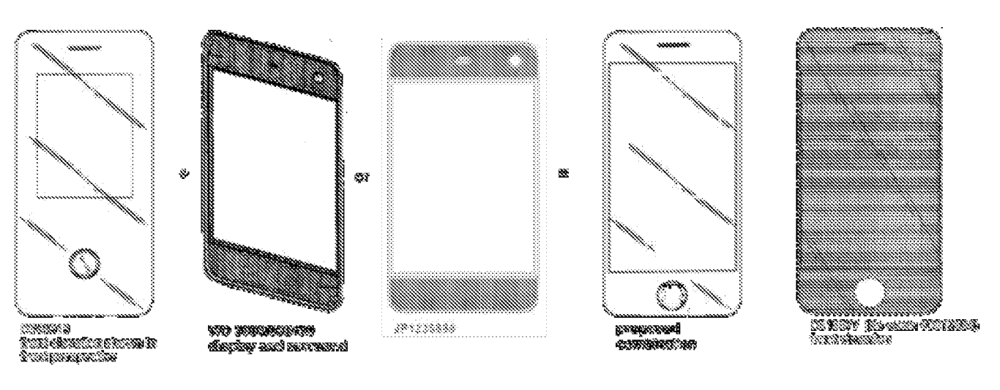

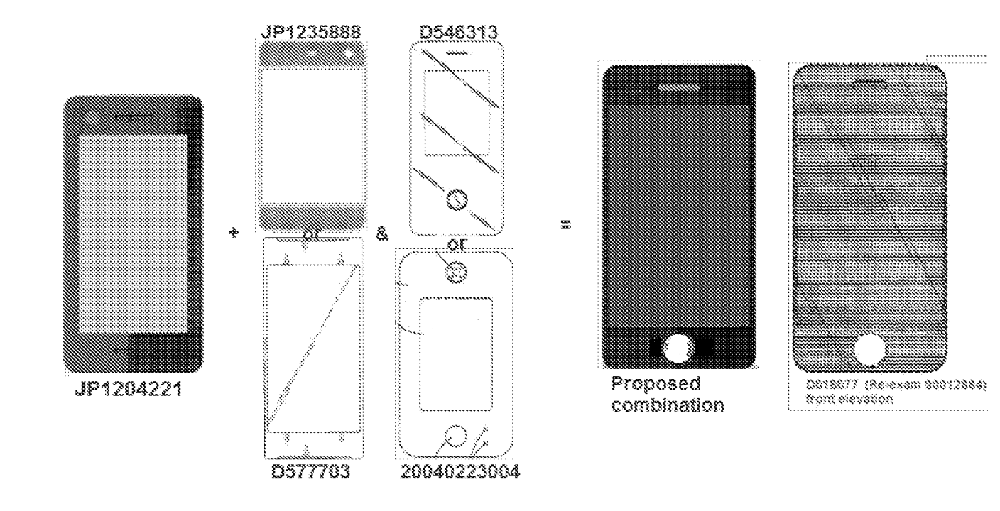

거절 이유도 LG D’313, JP D1204221에서 바로 도출될 수 있다고 한 것이 아니고, 위 도식처럼 다른 디자인을 결합하였을 때 도출될 수 있다는(그리고 그것이 자명하다는) 취지였습니다. 인터넷 기사의 특성상 내용을 생략하다 보니 몇가지 지점에서 오해가 발생한 것 같네요.

여하튼 위와 같은 이유로 Non-final rejection을 내리고, 애플은 이를 다투는 의견서를 제출합니다. 특허청의 주장을 조목조목 반박했는데요, 총 77페에지에 걸쳐 D’677 특허가 유효한 이유를 강변합니다. 결국 이것이 받아들여져 당초 판정을 뒤집고 유효하게 살아남습니다.

물론 Non-final action 이후 내려진 항소심, 상고심 그리고 이어진 배상액 재산정 단계에 이르기까지 무효 판정을 뒤집는 통지가 나오지 않았으니 그러한 사실이 소송에 고려되었을 수는 있습니다. 하지만 D’677 특허가 무효라는 판정 역시 Non-final action에 불과하고, 최종 결정이 내려지기 전까지 특허는 유효한 것으로 취급되므로 배상액 산정에는 큰 영향을 미치지 않았을 것으로 생각됩니다. 실제로 배상액 재산정시 배심원 평결은 D’677 특허가 유효함을 전제로 배상액을 계산하고 있습니다. 

다소 내용이 길어졌는데, 요약하자면 D’677 특허는 유효하며, 침해 소송 전 과정에서 주된 공격 방법으로 활용되었습니다.

### 디자인특허 ②

**US D593087**(이하 “**D’087 특허**”)–“Electronic device” 입니다.

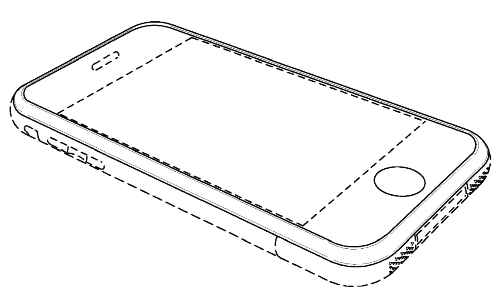

D’677 특허와 유사해 보이지만, 실선으로 표현한 부분이 다릅니다. D’087 특허는 홈버튼과 둥근 모서리, 좁은 베젤에 대한 특허입니다. 이때 홈버튼은 존재할 수도(실시예 1 등), 존재하지 않을 수도 있습니다(실시예 3 등)

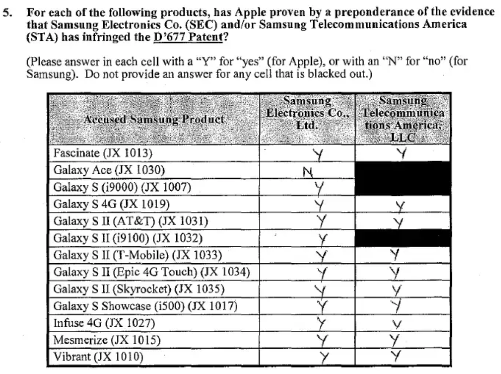

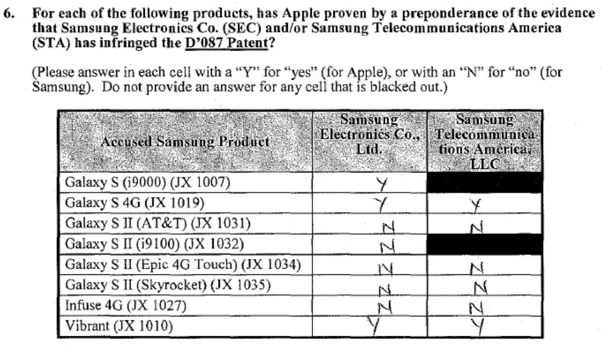

D’677 특허가 거의 모든 삼성 제품에 대해서 침해 인정이 된 반면에, D’087 특허는 갤럭시 S 등 3개 제품에서만 침해가 인정되었습니다. 사견으로 D’087 특허는 베젤과 둥근 모서리에 더 중점을 둔 특허임을 고려할 때 베젤의 두께와 둥근 모서리의 곡률을 엄격하게 고려한 결과로 생각됩니다. 위 사진을 보면 갤럭시 S와 갤럭시 S2의 미묘한 차이를 확인할 수 있습니다.

### 디자인특허 ③

**US D604305**(이하 “**D’305 특허**”)–“Graphical user interface for a display screen or portion thereof” 입니다. 

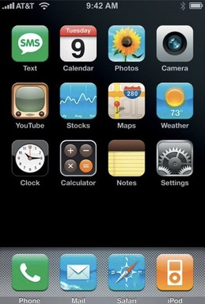

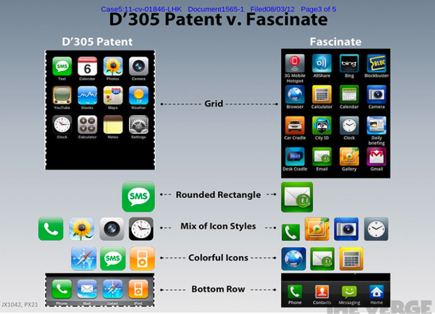

스마트폰 화면 중앙에 검은 배경 위의 둥근 모서리를 가진 사각 아이콘이 바둑판처럼(grid) 놓여 있는 형태의 디자인에 관한 특허입니다.  각 아이콘에 해당하는 기능까지 매칭될 필요는 없고, 오직 디자인적 관점에서만 이를 바라봐야 합니다. 

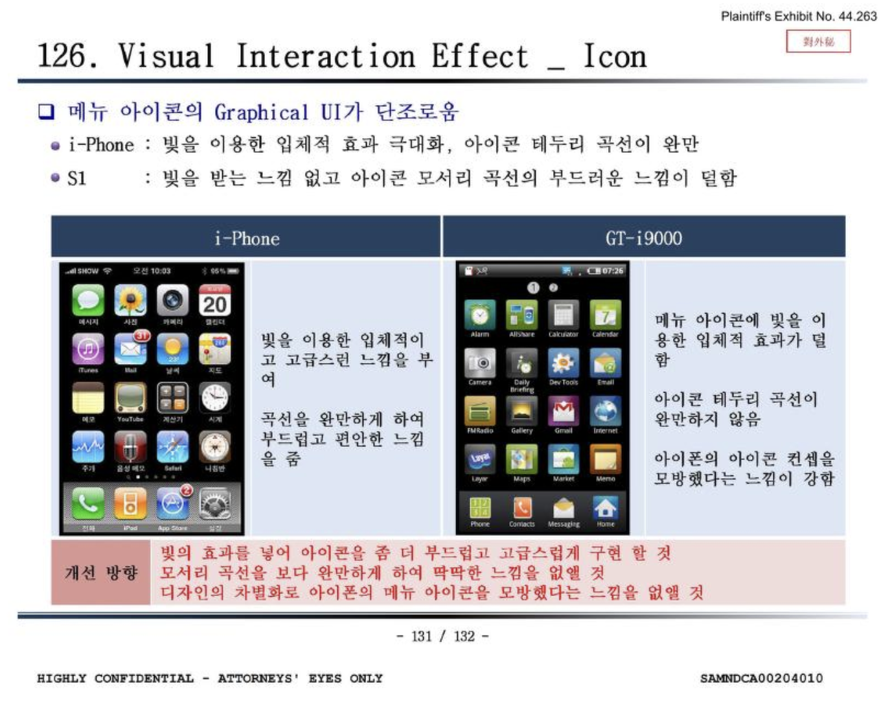

조사를 하다가 재미있는 자료를 발견했습니다. 삼성전자 제품기술팀 SW검증그룹에서 작성한 「S1, iPhone 비교 평가 결과」입니다. 애플 측에서 제시한 증거 중 하나이죠. 

아이폰의 아이콘을 모방했다는 느낌을 없앨 것을 개선 방향으로 제시하면서, “아이폰처럼” 빛의 효과를 넣고 모서리 곡선을 완만하게 하라는 주문도 같이 넣고 있습니다. 아이폰과 비슷하지만 비슷하지 않게? 디자이너는 쉽지 않았겠네요.

결국 지목된 삼성의 모든 제품들에 대해 D’305 특허의 침해가 인정되었습니다. 

## 트레이드 드레스

### 트레이드 드레스란?

트레이드 드레스(trade dress)는 제품이나 서비스의 전체적인 외관과 느낌을 보호하는 지식재산권의 한 형태입니다. 이는 단순한 로고나 브랜드명이 아니라 제품의 포장, 색상 조합, 디자인, 질감, 판매 방식 등 소비자가 제품의 출처를 인식하는 데 중요한 역할을 하는 요소들을 포함합니다. 대표적인 예로는 코카콜라 병의 독특한 곡선 디자인, 애플 스토어의 내부 배치, 스타벅스의 컵 디자인 등이 있습니다. 가령 우리가 어떤 물건이나 간판 등을 보고 “‘스타벅스 느낌’이 난다, ‘애플 스타일’이다”라고 느낄 수 있다면 그것이 트레이드 드레스가 될 수 있는 것이죠. 

미국은 트레이드 드레스를 연방상표법에서 보호하고 있습니다. 우리나라는 트레이드 드레스를 보호하는 명시적인 규정은 없지만, 상표법상 입체상표 제도를 통해 보호받거나 상표로서 등록받지 않더라도 부정경쟁방지법을 통해 보호받을 수 있습니다.

### 트레이드 드레스의 의의 및 보호 요건

특허제도는 **독점과 개방**을 기본 원리로 하고 있습니다. 발명자에게 그 발명을 독점할 권리를 부여하고, 보호기간이 지나면 그 권리는 소멸하여 발명이 공공재로 되는 것이죠. 일정 기간동안 특정인에게 기술이 독점되더라도 종국적으로는 모두가 그 기술을 누리는 것이 공공의 이익에 부합하기 때문입니다. 디자인도 마찬가지입니다.

반면에 트레이드 드레스는 특허가 아닌 **상표**의 일종입니다. 상표는 어떤 기술이나 외관이 아닌 그 주체의 신용을 보장하기 위해 존재합니다. 애플의 멀티터치 기술을 모든 기업이 쓸 수 있다면 산업 발전에 도움이 되겠지만, 애플의 “명성”을 다른 기업들이 나눠 쓸 필요는 없습니다. 그렇기 때문에 디자인권과 보호 대상이 유사함에도 불구하고 트레이드 드레스는 **영속적인 보호**가 가능합니다.

여기서 트레이드 드레스가 보호를 받기 위한 요건 세 가지가 도출됩니다. ①먼저, 소비자가 해당 외관을 보고 특정 브랜드를 연상할 수 있어야 하며, 이를 **‘출처 표시 기능’**이라고 합니다. 상표의 기본적인 기능이죠. ②또한, 영속적인 보호가 가능하기 때문에 보호 대상이 제품의 기능적인 요소가 아니라는 **‘비기능성’** 요건을 만족해야 합니다. 만일 트레이드 드레스가 기능적 요소를 가진다면 **사실상 보호기간이 무한대인 특허**를 인정하는 셈이 되니까요. ③ 마지막으로 시간이 지나면서 소비자들이 이를 브랜드의 독특한 특징으로 인식하게 되는 **‘획득된 식별력(secondary meaning)’**이 있어야 합니다. ‘주지성’이라고도 하는데요, “Apple Inc.”이라는 상표는 바로 출처 표시임을 직감하게 하지만 “애플 스토어의 상품 배치”는 애플 정도로 유명한 브랜드여야만 사람들이 출처 표시로 인식할 수 있기 때문입니다. 

### 애플의 아이폰 트레이드 드레스

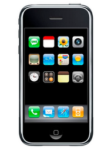

> US 77303282 상표의 설명:
The mark consists of the configuration of a rectangular handheld mobile digital electronic device with rounded silver edges, a black face, and an array of 16 square icons with rounded edges. <후략>
(이 상표는 **은색으로 둥글게 마감된 가장자리**, **검은색 전면**, 그리고 **둥근 모서리를 가진 16개의 정사각형 아이콘 배열**로 구성된 **직사각형 형태의 휴대용 모바일 디지털 전자 기기**의 디자인을 포함한다.)
> 

애플은 특허청에 등록한 트레이드 드레스 1건과, 등록하진 않았으나 1심 법원에서 인정된 트레이드 드레스 1건을 가지고 있었습니다. 미등록 트레이드 드레스는 iPhone 3G에 관한 것으로, 등록 트레이드 드레스와 크게 다르지 않습니다. 등록 트레이드 드레스의 표장과 설명은 위와 같습니다.

<aside>
❓ 상표를 보호하는 방식은 크게 **사용주의**와 **등록주의**로 나뉩니다. 사용주의는 상표를 먼저 사용한 자에게 그 상표를 사용할 권리를 부여하고, 등록주의는 관청에 상표를 먼저 등록한 사람이 권리를 취득하는 것을 원칙으로 합니다. 한국, 유럽, 일본 등 대부분의 국가는 등록주의를, 미국은 사용주의를 취하고 있습니다. 그럼에도 불구하고 미국은 등록상표라는 개념이 존재하는데요, 상표를 등록하면 향후 침해소송에서 그 상표의 소유자임을 입증하는 것이 훨씬 쉬워지는 이점이 있습니다. 한편 일상생활에서 흔히 볼 수 있는 ™️ 기호는 등록 여부와 무관하게 상표(TradeMark)임을 나타내는 기호이고, ® 기호는 등록된 상표를 나타내는 기호입니다.
</aside>

배심원들은 1심 평결에서 갤럭시 S의 트레이드 드레스 침해는 인정하고, 갤럭시 S2의 침해는 인정하지 않았습니다. “은색으로 둥글게 마감된 가장자리 ~ 디자인“은 애플의 상징이었는데, 갤럭시 S도 이것을 따라쓰니 애플의 유니크함, 즉 식별력이 훼손되었다는 것이죠(이를 “희석화 - Dilution”라고 부릅니다). 반면 갤럭시 S2는 좀 다르게 생겼으니 다른 결론을 낸 것이죠.

하지만 항소심 법원이었던 CAFC는 1심 평결을 파기합니다. 앞서 살폈던 트레이드 드레스의 3요건 중 “비기능성” 요건을 충족하지 못한다고 본게 그 이유였습니다. 가령 **둥근 모서리**는 주머니에 쉽게 넣기 쉽게 하고 내구성을 높이는 기능을 하고, **직사각형 형태의 평평한 전면 디자인**은 디스플레이를 최대한 활용하기 위한 필수적인 구조로 기능적 요소를 담고 있다는 것이죠. 그 외에도 기능성을 지적하는 여러 논거들이 있었습니다.

결국 1심 재판에서 애플 공격의 세 축 중 하나였던 트레이드 드레스는 무효화되어 이에 기한 침해 주장은 기각되었습니다.

## 애플이 둥근 모서리 디자인를 독점했다?

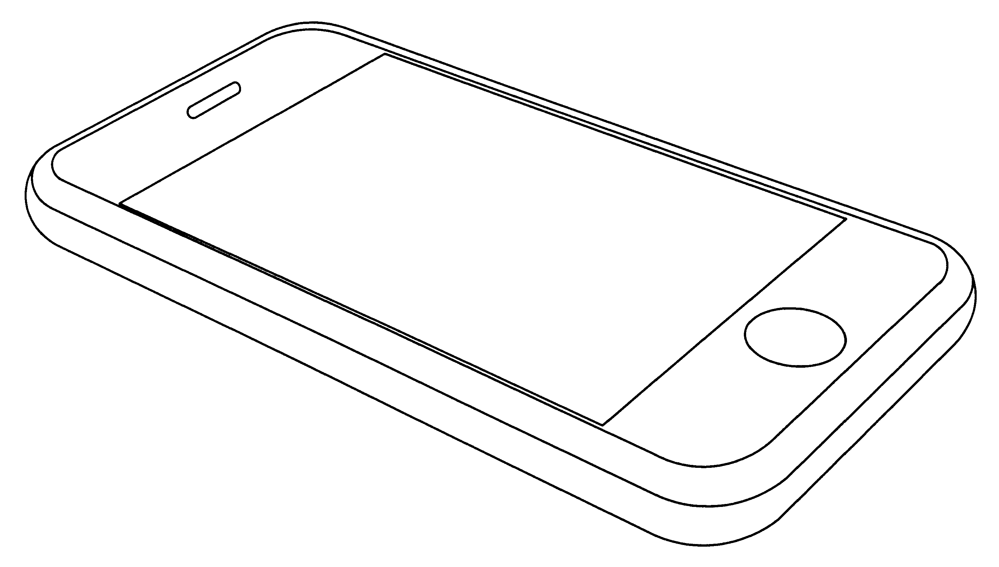

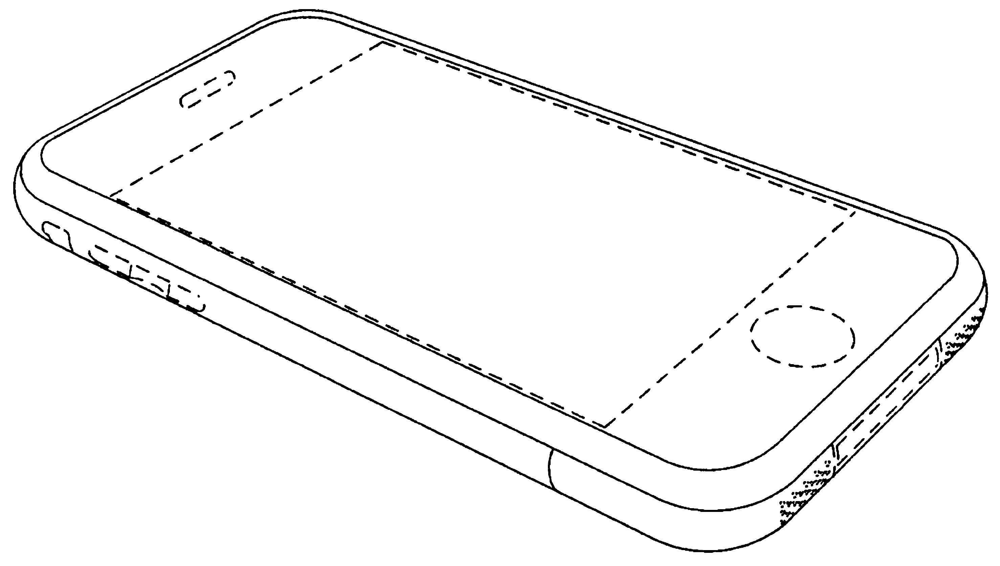

미국에서의 1심 평결이 있은 후 많은 한국 언론이 평결을 비판했습니다. 대표적으로  <[모서리 둥근 직사각형은 모두 애플세 대상?](https://www.ebn.co.kr/news/articleView.html?idxno=566969)> 에서는  「”*특히 애플의 디자인 특허는 ´모서리가 둥근 직사각형 모양이며 두께가 얇고 앞면이 평평하다´ 정도의 모호한 개념만을 담고 있음에도 불구하고 디자인 특허가 그대로 인정돼 논란이 일고 있다. 이에 삼성뿐 아니라 다른 기업들 사이에서도 "이런 논리라면 모두가 특허침해 기업이 될 수 있는 것 아니냐"는 우려가 나오고 있다.”라고 주장했다.* 」 라고 말합니다. 반면 <[둥근 모서리 사각형은 모두 특허 침해? 한국 언론의 호들갑](https://www.mediatoday.co.kr/news/articleView.html?idxno=104512)> 이런 기사도 있습니다. 과연 애플이 세상의 모든 “둥근 모서리 직사각형”을 독점한 것일까요?

애플의 소위 “둥근 모서리”에 관한 디자인특허, 트레이드 드레스 주장을 살펴보았습니다. 트레이드 드레스 주장은 결론적으로 기각되었으니 디자인특허에 대해서만 논해보도록 합시다.

어찌저찌 글을 읽어봐도, 여전히 의문이 가시지 않을 수 있습니다. 제일 먼저 드는 생각은 **“저런 것도 (디자인)특허가 돼?”** 아닐까요? 저도 들었던 생각입니다. 액정 화면을 가진 기기라면 당연히 가운데 직사각형 디스플레이가 있고 액정 보호를 위해 베젤을 둘 것이며, 물리적 세상에 완벽히 각진 직사각형이란 없으니 당연히 모서리는 둥글어야 할 것이니까요. 스마트폰을 만드려면 그런 요소들을 무조건 갖추어야 하는데, 애플이 여기에 특허를 내버리면 다른 회사들은 그걸 빗겨가느라 삼각형 모양의 스마트폰을 만들어야하는게 아닌가 걱정됩니다.

그러나 그런 것도 특허를 받을 수 있습니다. D’087과 유사한 디자인이 우리나라에서 디자인권으로 다수 등록된걸 보면, 미국이 특별하게 저런 특허를 허용해주는 것도 아닙니다. 이러한 디자인이 특허를 받을 수 있는 이유는, 그에 맞게 **권리의 범위를 조절**해주면 그만이기 때문입니다.

이미 알려진, 즉 ‘공지’된 형상은 창작자의 기여도가 낮기 때문에 넓은 권리범위를 인정하지 않습니다. 그리고 디자인을 변형할 수 있는 폭이 좁은 경우, 작은 변화에도 일반 수요자가 큰 차이를 느낄 수 있기 때문에 ‘유사’의 범위가 좁아지게 되고 이 경우에도 권리범위는 좁아집니다.

모서리를 예시로 들어볼까요? 모서리가 둥근 전자기기는 아이폰 이전에도 많이 있었습니다. 대표적으로 LG전자의 프라다폰이 그랬습니다. 그래서 아이폰의 디자인 중 둥근 모서리에는 그 창작의 기여도를 크게 인정할 수 없고, 그 부분에 대한 좁은 권리범위를 가지게 만듭니다. 또한 휴대폰은 대부분 직사각형 모양이고 그렇다면 모서리도 어느정도 둥근 직각 형태일 수 밖에 없습니다. 거기서 변형을 한다면 곡률 정도나 변형 가능하겠죠. 이 역시 권리범위를 좁게 만듭니다. 둥근 모서리의 권리범위가 좁다는 것은, 도면에 나타난 아이폰의 모서리와 정말 비슷하게 생겨야만 그 권리를 침해한다는 의미가 됩니다.

이처럼 권리의 범위를 좁게 조절해준다면 부당한 독점의 문제가 발생하지 않습니다. 디자인을 문장으로 표현하면 “둥근 모서리를 가진 베젤을 포함한 전면부”이겠지만, 다른 기업은 모서리의 곡률과 베젤의 두께가 아이폰의 그것과는 조금 다른 전면부를 가진 스마트폰을 만들어낼 수 있습니다. 그것은 애플 특허의 권리범위 바깥에 있으니까요.

그리고 무엇보다 D’677, D’087 특허는 둥근 모서리만을 구성요소로 하고 있지 않습니다. 사각형 틀 안에 홈버튼의 위치와 화면 배치, 베젤의 형상 등 전체적인 구성을 하나의 디자인으로 보기 때문입니다. 그 전체적인 구성을 봤을때 느껴지는 전체적인 심미감이 유사한지가 중요한 것이죠.

**따라서 애플이 “둥근 모서리”를 독점했다는 말은 적절치 않다고 생각합니다.** 둥근 모서리와 베젤을 가지고 있다고 해서 바로 D’087과 유사한 디자인이라고 단정할 수 없고, 세부적인 요소들이 아이폰의 그것과 유사해서 전체적으로 비슷한 심미감을 낼 때 비로소 유사한 디자인이 되는 것입니다. 

---

애플의 디자인특허 침해 주장은 애플과 삼성이 최종적으로 합의하기까지 소송의 중심적인 역할을 했습니다. 상고심에서 일부 감액되기는 하였지만, 여전히 최종 배상액에서 가장 큰 비중을 차지했습니다. 이 사건으로 인해 기업의 지식재산권, 특히 디자인 보호의 필요성이 크게 대두되었고, 삼성과 LG 등 대기업들은 변리사・특허전문변호사를 다수 영입하기도 했습니다[[기사](https://news.mt.co.kr/mtview.php?no=2012110514461292801)].

1편, 2편에 걸쳐서 <애플 v. 삼성전자>를 살펴보았습니다. 다음 글에서는 삼성의 반격, <삼성전자 v. 애플>에 대해 다루어 보겠습니다. 해당 소송에서는 특허업계에서 중요하게 다루어지는 **표준특허**가 주요 쟁점이었습니다. 그리고 침해소송과 같이 병행되었던 ITC 수입금지명령 소송에 대해서도 이야기해보고자 합니다. 이는 요즘 트럼프 행정부의 횡보에서 나타나는 **보호무역주의**와도 관련이 있습니다.

